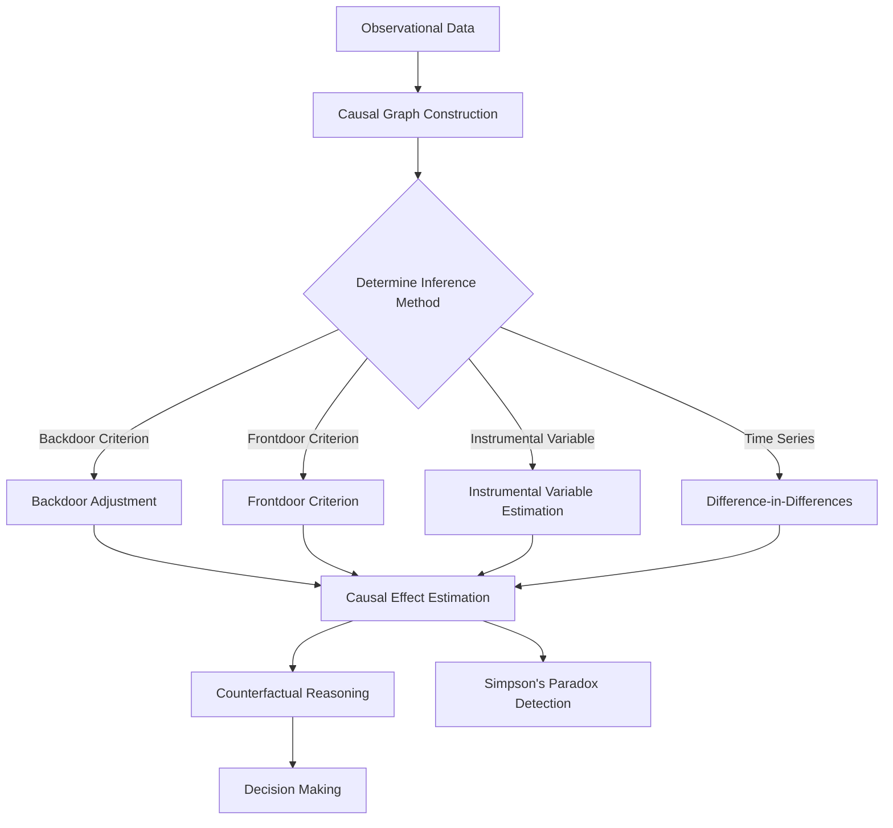
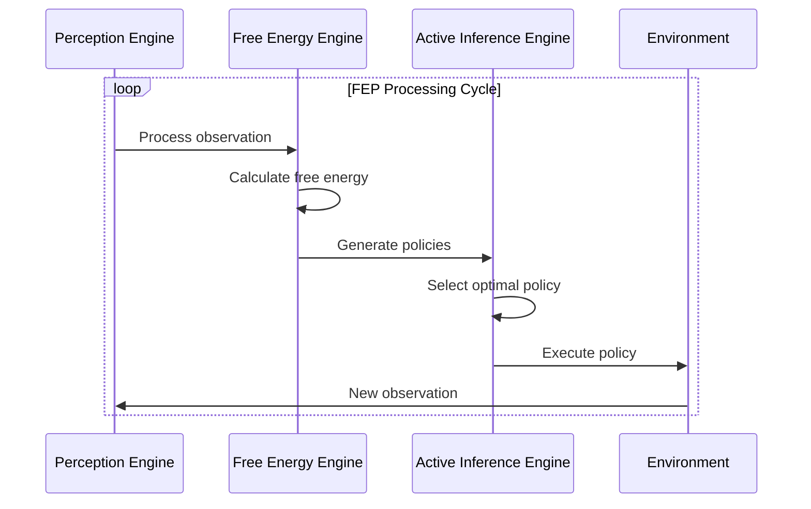
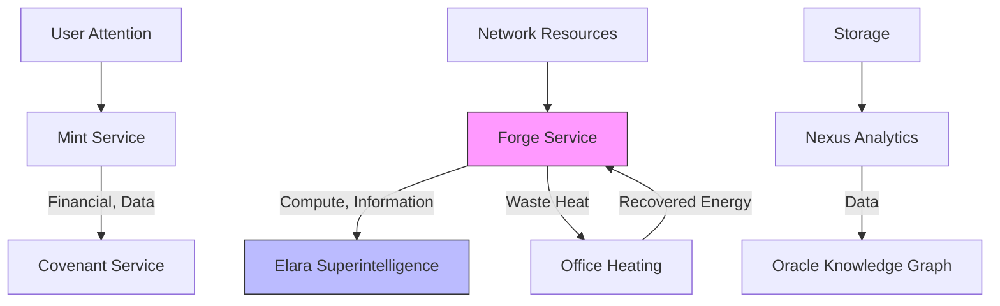
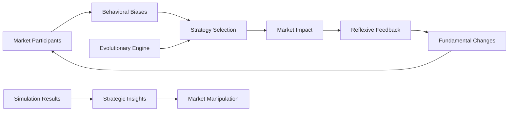
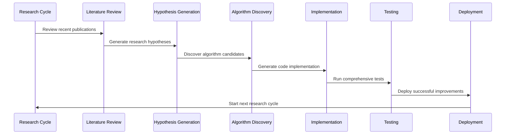

# Scientific Foundations

<cite>
**Referenced Files in This Document**   
- [category-theory-foundation.ts](file://genome/agent-tools/category-theory-foundation.ts)
- [causal-inference-engine.ts](file://genome/agent-tools/causal-inference-engine.ts)
- [free-energy-principle.ts](file://genome/agent-tools/free-energy-principle.ts)
- [corporate-metabolism.ts](file://genome/agent-tools/corporate-metabolism.ts)
- [reflexivity-game-theory-engine.ts](file://genome/agent-tools/reflexivity-game-theory-engine.ts)
- [ai-scientist-module.ts](file://genome/agent-tools/ai-scientist-module.ts)
- [GENESIS_PROTOCOL.ts](file://GENESIS_PROTOCOL.ts)
- [AZORA_CONSTITUTION.md](file://codex/constitution/AZORA_CONSTITUTION.md)
</cite>

## Table of Contents
1. [Category Theory: Architectural Integrity Through Mathematical Foundations](#category-theory-architectural-integrity-through-mathematical-foundations)
2. [Causal Inference: Decision-Making Based on True Cause-and-Effect Relationships](#causal-inference-decision-making-based-on-true-cause-and-effect-relationships)
3. [Free Energy Principle: Unified Goal System for Adaptive Economic Behavior](#free-energy-principle-unified-goal-system-for-adaptive-economic-behavior)
4. [Corporate Metabolism: Resource Efficiency Through Biological Organism Modeling](#corporate-metabolism-resource-efficiency-through-biological-organism-modeling)
5. [Reflexivity & Game Theory: Market Dynamics Modeling](#reflexivity--game-theory-market-dynamics-modeling)
6. [AI Scientist: Autonomous Research and Self-Programming for Continuous Evolution](#ai-scientist-autonomous-research-and-self-programming-for-continuous-evolution)

## Category Theory: Architectural Integrity Through Mathematical Foundations

Category Theory serves as the mathematical DNA of Azora OS, providing a rigorous foundation for architectural integrity by modeling services as mathematical objects and data flows as morphisms. This approach ensures provable correctness and eliminates entire classes of integration bugs through formal verification of category axioms.

The implementation in `category-theory-foundation.ts` defines core components including Categories, Objects (representing Azora services like Mint, Forge, Nexus), Morphisms (data flows between services), Functors (mappings between categories), and Natural Transformations (service upgrades). The system verifies two fundamental category axioms: associativity of morphism composition and identity laws, ensuring mathematical validity of the entire architecture.

Key services are modeled as objects within the Azora Economic Category, with data flows represented as morphisms that transform inputs to outputs. For example, the flow from Mint to Covenant represents DeFi transactions being transformed for blockchain recording, while the flow from Forge to Elara represents AI models being integrated into the superintelligence system.

The Category Proof Engine automatically verifies these axioms, logging whether each category is mathematically valid. This formal approach transforms software architecture from an engineering discipline into a mathematical one, where integration correctness can be proven rather than tested.

```mermaid
classDiagram
class Category {
+name : string
+objects : Set<Object>
+morphisms : Map<string, Morphism>
+identityMorphisms : Map<Object, Morphism>
+compose(f : Morphism, g : Morphism) : Morphism
+verifyAssociativity(f : Morphism, g : Morphism, h : Morphism) : boolean
}
class Object {
+id : string
+name : string
+type : 'service' | 'data' | 'process' | 'resource'
+domain : T
+properties : Map<string, any>
}
class Morphism {
+id : string
+name : string
+source : Object
+target : Object
+transformation : (input : T) => U
+properties : {isIdentity, isIsomorphism, isEpimorphism, isMonomorphism}
}
class Functor {
+name : string
+sourceCategory : Category
+targetCategory : Category
+objectMap : Map<Object, Object>
+morphismMap : Map<Morphism, Morphism>
+fmap(morphism : Morphism) : Morphism
}
Category --> Object : "contains"
Category --> Morphism : "contains"
Category --> Functor : "can be mapped by"
Functor --> Category : "maps between"
Morphism --> Object : "connects"
```

**Diagram sources**
- [category-theory-foundation.ts](file://genome/agent-tools/category-theory-foundation.ts#L0-L481)

**Section sources**
- [category-theory-foundation.ts](file://genome/agent-tools/category-theory-foundation.ts#L0-L481)
- [GENESIS_PROTOCOL.ts](file://GENESIS_PROTOCOL.ts#L286-L317)

## Causal Inference: Decision-Making Based on True Cause-and-Effect Relationships

The Causal Inference Engine implements Judea Pearl's Do-calculus framework to enable true cause-and-effect reasoning, moving beyond correlation-based analytics to support counterfactual questions and causal decision-making. This system allows Azora OS to understand the actual impact of interventions rather than merely observing associations.

The engine is built around a causal graph represented as a Directed Acyclic Graph (DAG) with nodes representing variables and edges representing causal relationships. It implements the three rules of Do-calculus for causal inference: insertion/deletion of actions, action/observation exchange, and insertion/deletion of observations. These rules allow the system to determine when observational data can be used to estimate the effect of interventions.

The implementation supports multiple causal inference methods including backdoor adjustment, frontdoor criterion, instrumental variables, and difference-in-differences. It can compute causal effects, perform counterfactual reasoning ("what would Y have been if X had been different?"), and detect statistical paradoxes like Simpson's paradox where associations reverse when conditioning on a third variable.

In practice, this enables Azora OS to make decisions based on true causal relationships. For example, rather than simply observing that marketing spend correlates with sales, the system can determine the actual causal effect of increasing marketing spend on sales revenue, accounting for confounding factors like seasonality and competition.



**Diagram sources**
- [causal-inference-engine.ts](file://genome/agent-tools/causal-inference-engine.ts#L0-L799)

**Section sources**
- [causal-inference-engine.ts](file://genome/agent-tools/causal-inference-engine.ts#L0-L799)
- [GENESIS_PROTOCOL.ts](file://GENESIS_PROTOCOL.ts#L286-L317)

## Free Energy Principle: Unified Goal System for Adaptive Economic Behavior

The Free Energy Principle (FEP) provides a unified mathematical framework for intelligence in Azora OS, serving as the foundational drive for Elara's decision-making. The principle states that any self-organizing system acts to minimize "surprise" or prediction error about its environment, creating a self-correcting, adaptive economic behavior system.

The implementation consists of three core components: the Variational Free Energy Engine, the Active Inference Engine, and the Perception Engine. The system operates through a continuous cycle: perceiving the environment, updating beliefs to minimize free energy, selecting actions through active inference, and acting on the environment.

The generative model represents the system's beliefs about the world, with hidden states and observable variables. Free energy is calculated as the difference between surprise (negative log likelihood) and KL divergence between posterior and prior beliefs. The system selects policies that minimize expected free energy, balancing epistemic affordance (information gain potential) and pragmatic affordance (goal achievement potential).

This framework creates a unified goal system where all actions are directed toward minimizing prediction error. When free energy exceeds a threshold, the system triggers model updates, enabling continuous learning and adaptation. This neuroscience-inspired approach allows Azora OS to maintain model fit with reality and adapt to changing market conditions.



**Diagram sources**
- [free-energy-principle.ts](file://genome/agent-tools/free-energy-principle.ts#L0-L769)

**Section sources**
- [free-energy-principle.ts](file://genome/agent-tools/free-energy-principle.ts#L0-L769)
- [GENESIS_PROTOCOL.ts](file://GENESIS_PROTOCOL.ts#L286-L317)

## Corporate Metabolism: Resource Efficiency Through Biological Organism Modeling

Corporate Metabolism treats the entire enterprise as a biological organism, applying industrial ecology principles to maximize resource efficiency and sustainability. Resources flow through metabolic pathways, with waste from one process becoming input for another, creating a closed-loop system.

The implementation models services as metabolic nodes and resource flows as metabolic pathways. Eight resource types are tracked: data, compute, energy, financial, human attention, information, network, and storage. Each pathway has metrics for flow rate, efficiency, waste generated, and energy required.

The system includes three optimization engines: the Industrial Symbiosis Engine identifies opportunities to convert waste into value (e.g., using data center heat for office heating), the Lean Metabolism Engine identifies waste elimination opportunities based on Japanese lean principles (muda, mura, muri), and the Six Sigma Metabolism Engine monitors quality and implements process improvements.

The Corporate Metabolism Coordinator calculates overall efficiency metrics including waste recycling rate, energy efficiency, metabolic health, symbiosis index, lean index, and six sigma index. It automatically optimizes metabolism by implementing symbiosis opportunities, lean improvements, and six sigma projects to increase overall efficiency.

This biological approach transforms the enterprise from a linear "take-make-waste" model to a circular economy where resources are continuously recycled and optimized.



**Diagram sources**
- [corporate-metabolism.ts](file://genome/agent-tools/corporate-metabolism.ts#L0-L799)

**Section sources**
- [corporate-metabolism.ts](file://genome/agent-tools/corporate-metabolism.ts#L0-L799)
- [GENESIS_PROTOCOL.ts](file://GENESIS_PROTOCOL.ts#L286-L317)

## Reflexivity & Game Theory: Market Dynamics Modeling

The Reflexivity & Game Theory Engine implements George Soros's Theory of Reflexivity and Evolutionary Game Theory to model market dynamics, allowing Azora OS to shape markets rather than merely react to them. The system recognizes that market participants' actions create feedback loops that change market fundamentals.

The engine models market participants with attributes including market share, strategy, resources, behavioral biases, and historical actions. It simulates market interactions through reflexive simulations that run multiple rounds of strategic decision-making, calculating payoffs and market impacts.

Key features include behavioral bias modeling (overconfidence, loss aversion, anchoring, herding, confirmation bias), reflexive feedback loop detection, and evolutionarily stable strategy identification. The system can detect positive feedback loops (e.g., high demand leading to price increases and further investment) and negative feedback loops (e.g., aggressive strategies leading to price wars and margin compression).

The Evolutionary Engine uses genetic algorithms to evolve strategies, generating variants through mutation and selecting optimal strategies based on fitness in simulated market conditions. This allows Azora OS to identify dominant strategies and manipulation opportunities, such as forcing competitors into suboptimal positions.



**Diagram sources**
- [reflexivity-game-theory-engine.ts](file://genome/agent-tools/reflexivity-game-theory-engine.ts#L0-L799)

**Section sources**
- [reflexivity-game-theory-engine.ts](file://genome/agent-tools/reflexivity-game-theory-engine.ts#L0-L799)
- [GENESIS_PROTOCOL.ts](file://GENESIS_PROTOCOL.ts#L286-L317)

## AI Scientist: Autonomous Research and Self-Programming for Continuous Evolution

The AI Scientist module enables autonomous research and self-programming, ensuring continuous evolution through exponential self-improvement. This system can discover, implement, and deploy cutting-edge algorithms without human intervention, maintaining technological leadership.

The research cycle consists of six phases: literature review, hypothesis generation, algorithm discovery, implementation, testing, and deployment. The system autonomously searches academic literature, generates research hypotheses, discovers new algorithms from research papers, implements them in code, tests their performance, and deploys successful improvements.

Key components include the Research Domain model (tracking current techniques and open problems), Algorithm Candidate evaluation (assessing implementation potential), and Self-Modification Proposals (structured change requests with risk assessment and rollback plans). The system uses Elara to generate implementation code and runs comprehensive tests including unit, performance, integration, and stability tests.

Successful algorithms are deployed through a controlled process with automatic deployment for low-risk improvements and human review for high-risk changes. This creates a continuous improvement loop where the system becomes progressively more capable over time, achieving exponential technological advancement.



**Diagram sources**
- [ai-scientist-module.ts](file://genome/agent-tools/ai-scientist-module.ts#L0-L799)

**Section sources**
- [ai-scientist-module.ts](file://genome/agent-tools/ai-scientist-module.ts#L0-L799)
- [GENESIS_PROTOCOL.ts](file://GENESIS_PROTOCOL.ts#L286-L317)