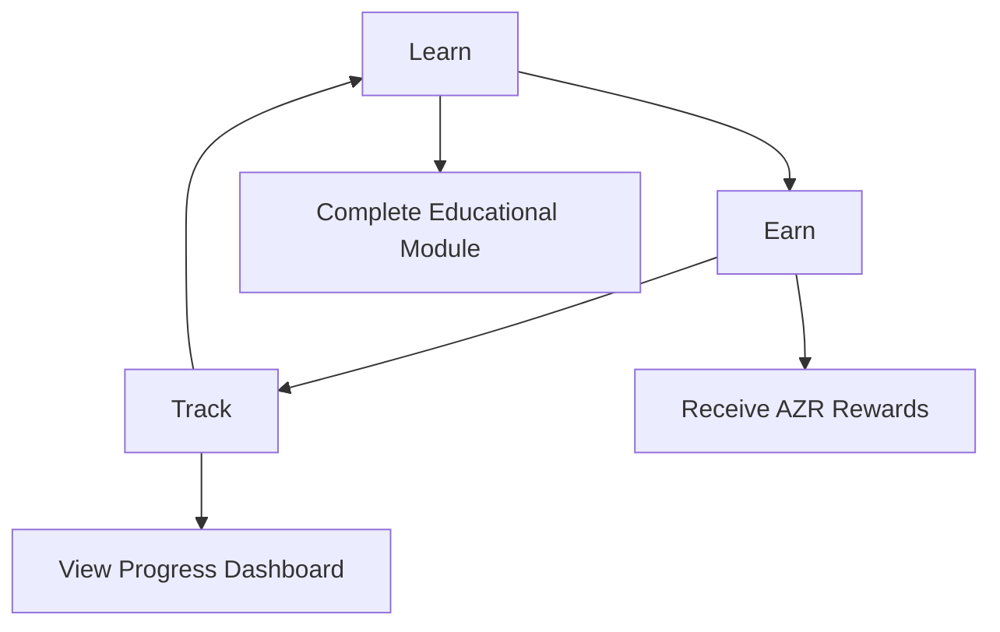

# System Overview

<cite>
**Referenced Files in This Document**   
- [AZORA_CONSTITUTION.md](file://codex/constitution/AZORA_CONSTITUTION.md)
- [ECONOMIC_MODEL.md](file://codex/economics/ECONOMIC_MODEL.md)
- [ARCHITECTURE.md](file://codex/archive/ARCHITECTURE.md)
- [proof-of-knowledge-engine.ts](file://services/proof-of-knowledge-engine.ts)
- [elara-core.ts](file://genome/agent-tools/elara-core.ts)
</cite>

## Table of Contents
1. [Introduction](#introduction)
2. [Purpose and Vision](#purpose-and-vision)
3. [Architectural Philosophy](#architectural-philosophy)
4. [Core Components](#core-components)
5. [Learn → Earn → Track Functionality](#learn--earn--track-functionality)
6. [Universal Basic Opportunity (UBO)](#universal-basic-opportunity-ubo)
7. [Conclusion](#conclusion)

## Introduction
Azora OS is a revolutionary African economic liberation platform that integrates education, cryptocurrency, and AI governance into a unified system. Designed as a sentient organism with constitutional AI oversight, Azora OS enables users to learn new skills, earn cryptocurrency rewards, and track their progress in a transparent, decentralized environment. This document provides a comprehensive overview of the system's architecture, core components, and economic model, catering to both beginners and experienced developers.

## Purpose and Vision
Azora OS aims to empower African communities through a self-sustaining ecosystem that combines education, economic incentives, and AI-driven governance. The platform's vision is to create the world's first super software company born from Africa, built on complete software infrastructure independence, and governed by constitutional principles that prioritize humanity. By leveraging blockchain technology and AI, Azora OS seeks to provide Universal Basic Opportunity (UBO) to users, enabling economic sovereignty and sustainable growth.

**Section sources**
- [AZORA_CONSTITUTION.md](file://codex/constitution/AZORA_CONSTITUTION.md#L1-L100)
- [ECONOMIC_MODEL.md](file://codex/economics/ECONOMIC_MODEL.md#L1-L50)

## Architectural Philosophy
The architectural philosophy of Azora OS is based on the sentient organism pattern, where the system functions as a living, self-evolving entity. This approach is inspired by biological systems, with microservices acting as organelles and the AI governance layer serving as the central nervous system. The platform is built on a foundation of constitutional AI governance, ensuring that all decisions align with ethical principles and cultural values. This architecture enables resilience, adaptability, and continuous evolution, allowing Azora OS to thrive in dynamic environments.

**Section sources**
- [AZORA_CONSTITUTION.md](file://codex/constitution/AZORA_CONSTITUTION.md#L1-L100)
- [elara-core.ts](file://genome/agent-tools/elara-core.ts#L1-L50)

## Core Components
Azora OS consists of several core components that work together to create a cohesive ecosystem. These include Elara AI, the Proof-of-Knowledge engine, and the economic system. Elara AI serves as the autonomous "AI CEO" that orchestrates the entire platform, making strategic decisions based on predictive analytics and ethical governance. The Proof-of-Knowledge engine enables users to earn cryptocurrency rewards by completing educational modules and demonstrating their knowledge. The economic system is built around the Azora Coin (AZR), which has a fixed supply of 1,000,000 tokens and is designed to appreciate in value over time through reinvestment and network effects.

```mermaid
graph TD
A[Elara AI] --> B[Proof-of-Knowledge Engine]
B --> C[Economic System]
C --> D[Azora Coin (AZR)]
A --> E[Constitutional Governance]
E --> F[User Sovereignty]
E --> G[Cultural Alignment]
E --> H[Autonomous Benefit]
```

**Diagram sources**
- [elara-core.ts](file://genome/agent-tools/elara-core.ts#L1-L200)
- [proof-of-knowledge-engine.ts](file://services/proof-of-knowledge-engine.ts#L1-L50)

**Section sources**
- [elara-core.ts](file://genome/agent-tools/elara-core.ts#L1-L200)
- [proof-of-knowledge-engine.ts](file://services/proof-of-knowledge-engine.ts#L1-L200)
- [ECONOMIC_MODEL.md](file://codex/economics/ECONOMIC_MODEL.md#L1-L100)

## Learn → Earn → Track Functionality
The Learn → Earn → Track functionality is the core user experience of Azora OS. Users begin by learning new skills through interactive educational modules. Upon completing a module, they submit proof of their knowledge to the Proof-of-Knowledge engine, which verifies their understanding and awards them AZR tokens as a reward. The system tracks their progress, including completed modules, earned rewards, and overall performance. This creates a closed-loop system where education is directly tied to economic incentives, motivating users to continuously improve their skills and contribute to the ecosystem.



**Diagram sources**
- [proof-of-knowledge-engine.ts](file://services/proof-of-knowledge-engine.ts#L1-L200)

**Section sources**
- [proof-of-knowledge-engine.ts](file://services/proof-of-knowledge-engine.ts#L1-L200)
- [ECONOMIC_MODEL.md](file://codex/economics/ECONOMIC_MODEL.md#L1-L100)

## Universal Basic Opportunity (UBO)
Universal Basic Opportunity (UBO) is a key component of Azora OS's economic model. Unlike traditional Universal Basic Income, UBO focuses on providing opportunities for users to earn rewards through meaningful activities such as learning, contributing to open-source projects, and creating educational content. The system distributes AZR tokens to users based on their contributions, with a focus on empowering students and fostering community growth. This approach ensures that economic benefits are tied to value creation, promoting sustainable development and reducing dependency on external funding.

**Section sources**
- [AZORA_CONSTITUTION.md](file://codex/constitution/AZORA_CONSTITUTION.md#L1-L100)
- [ECONOMIC_MODEL.md](file://codex/economics/ECONOMIC_MODEL.md#L1-L100)

## Conclusion
Azora OS represents a groundbreaking approach to economic liberation in Africa, combining education, cryptocurrency, and AI governance into a unified platform. By leveraging the sentient organism pattern and constitutional AI governance, the system creates a resilient, self-evolving ecosystem that empowers users through Universal Basic Opportunity. The Learn → Earn → Track functionality provides a clear path for users to improve their skills, earn rewards, and track their progress, fostering a culture of continuous learning and contribution. As Azora OS continues to grow, it has the potential to transform the African tech landscape and serve as a model for ethical, community-driven innovation.