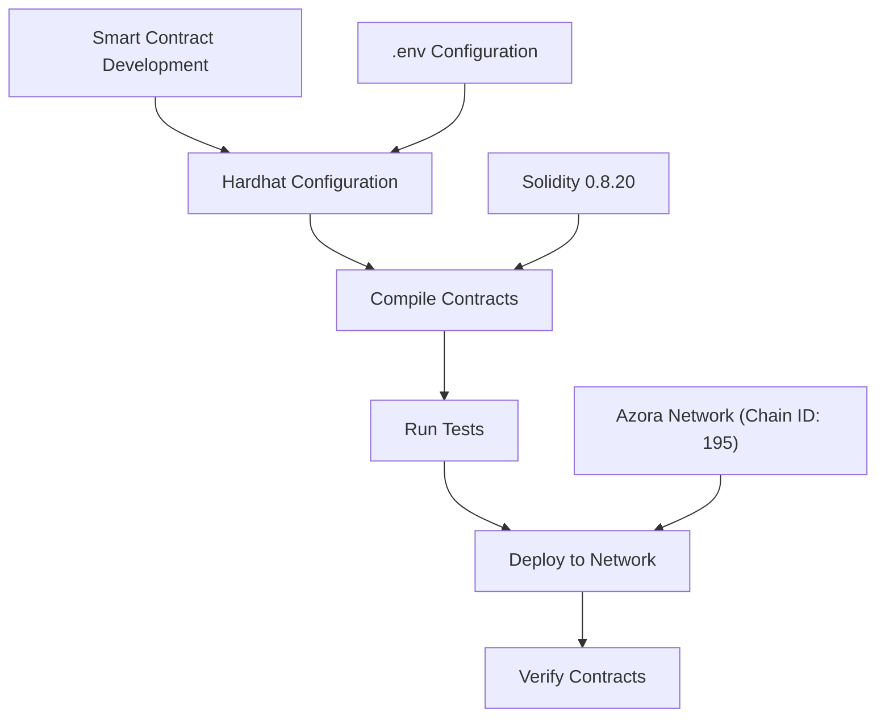
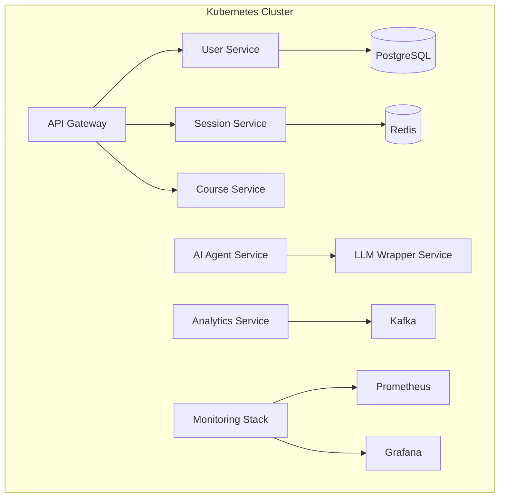
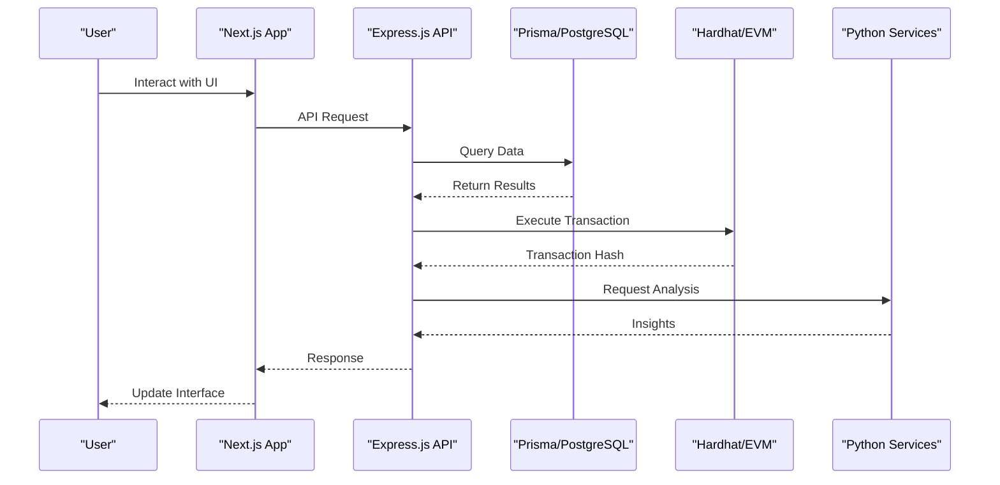

# Technology Stack

<cite>
**Referenced Files in This Document**   
- [azora/azora-mint-mine-engine-next/package.json](file://azora/azora-mint-mine-engine-next/package.json)
- [azora/azora-aegis/package.json](file://azora/azora-aegis/package.json)
- [azora/azora-ui/package.json](file://azora/azora-ui/package.json)
- [hardhat.config.ts](file://hardhat.config.ts)
- [infrastructure/k8s](file://infrastructure/k8s)
- [services/azora-mint](file://services/azora-mint)
- [genome/ui-components](file://genome/ui-components)
- [genome/ui-core](file://genome/ui-core)
</cite>

## Table of Contents
1. [Introduction](#introduction)
2. [Frontend with Next.js](#frontend-with-nextjs)
3. [Backend with Express.js](#backend-with-expressjs)
4. [Blockchain Development with Hardhat](#blockchain-development-with-hardhat)
5. [ORM with Prisma](#orm-with-prisma)
6. [Orchestration with Kubernetes](#orchestration-with-kubernetes)
7. [Programming Languages: TypeScript, Solidity, Python](#programming-languages-typescript-solidity-python)
8. [Technology Integration and Workflow](#technology-integration-and-workflow)
9. [Configuration Patterns and Integration Challenges](#configuration-patterns-and-integration-challenges)
10. [Conclusion](#conclusion)

## Introduction
The Azora OS technology ecosystem integrates modern frontend frameworks, robust backend services, blockchain infrastructure, and advanced orchestration tools to create a comprehensive platform for decentralized applications and AI-driven services. This document details the core technologies powering Azora OS, including Next.js for frontend development, Express.js for backend services, Hardhat for blockchain development, Prisma for database operations, and Kubernetes for container orchestration. The implementation leverages TypeScript as the primary language, Solidity for smart contracts, and Python for AI components, creating a cohesive stack that enables scalable, secure, and intelligent applications.

## Frontend with Next.js
Next.js serves as the primary frontend framework for Azora OS, powering multiple user interfaces including the mint mining engine and various UI components. The framework enables server-side rendering, static site generation, and API route handling within a unified architecture. The azora-mint-mine-engine-next application utilizes Next.js 16 with React 19, providing a modern development experience with optimized performance and developer tooling. The frontend stack integrates Tailwind CSS for styling, React Hook Form for form management, and Zod for schema validation, creating a responsive and accessible user experience. The framework's App Router architecture supports nested layouts, server components, and streaming, enabling efficient data loading and progressive enhancement.

**Section sources**
- [azora/azora-mint-mine-engine-next/package.json](file://azora/azora-mint-mine-engine-next/package.json)
- [azora/azora-ui/package.json](file://azora/azora-ui/package.json)

## Backend with Express.js
Express.js forms the backbone of Azora OS backend services, providing a minimal and flexible Node.js web application framework. The azora-aegis service implements Express.js as its core server framework, handling HTTP requests, routing, and middleware integration. The backend architecture incorporates CORS for cross-origin resource sharing, Helmet for security headers, and JWT-based authentication for secure API access. Express.js middleware chains enable request validation, logging, and error handling across microservices. The framework integrates with Prisma for database operations, Redis for caching, and Bull for job queuing, creating a scalable backend infrastructure. The use of TypeScript enhances type safety and developer productivity in backend development.

**Section sources**
- [azora/azora-aegis/package.json](file://azora/azora-aegis/package.json)
- [services/azora-mint](file://services/azora-mint)

## Blockchain Development with Hardhat
Hardhat provides the development environment for Ethereum-compatible smart contracts in the Azora OS ecosystem. The hardhat.config.ts configuration file defines network settings for local development, testing, and deployment to the Azora network. The framework supports Solidity 0.8.20 with optimizer settings enabled for gas efficiency. Hardhat's task runner enables automated contract compilation, testing, and deployment workflows. The configuration includes support for the EDR-simulated network type for local development and HTTP-based connections for the production network. The integration with dotenv allows secure management of private keys and RPC endpoints. Hardhat's extensibility through plugins enables custom tooling for contract verification, gas reporting, and deployment automation.

**Diagram sources**
- [hardhat.config.ts](file://hardhat.config.ts)
- [contracts](file://contracts)

## ORM with Prisma
Prisma serves as the Object-Relational Mapper (ORM) for database operations in Azora OS, providing type-safe database access and schema management. The azora-aegis service utilizes Prisma Client for TypeScript, enabling autocompleted queries and compile-time type checking. The Prisma schema defines data models that map to database tables, with support for relations, constraints, and indexes. The framework generates a query engine that translates TypeScript operations into optimized SQL queries, supporting PostgreSQL, MySQL, SQLite, and SQL Server. Prisma Migrate enables version-controlled schema evolution, while Prisma Studio provides a visual interface for data exploration. The integration with TypeScript enhances developer productivity by eliminating manual SQL query construction and reducing runtime errors.

**Section sources**
- [azora/azora-aegis/package.json](file://azora/azora-aegis/package.json)
- [services/azora-mint](file://services/azora-mint)

## Orchestration with Kubernetes
Kubernetes provides container orchestration for the Azora OS microservices architecture, ensuring high availability, scalability, and resilience. The infrastructure/k8s directory contains YAML manifests for deploying services including AI agents, analytics, API gateways, and database clusters. The configuration includes Deployments for stateless services, StatefulSets for stateful applications, and Services for network exposure. Network Policies define traffic rules between services, enhancing security through zero-trust principles. Horizontal Pod Autoscalers adjust replica counts based on CPU and memory metrics, while Probes ensure service health. The architecture supports multi-cluster deployments with ArgoCD for GitOps-based continuous delivery. Kubernetes enables blue-green deployments, canary releases, and rolling updates with minimal downtime.

**Diagram sources**
- [infrastructure/k8s](file://infrastructure/k8s)
- [vessels/docker-compose.yml](file://vessels/docker-compose.yml)

## Programming Languages: TypeScript, Solidity, Python
Azora OS leverages multiple programming languages for specialized purposes, with TypeScript as the primary language for frontend and backend development. TypeScript's static typing enhances code quality, enables better tooling, and reduces runtime errors across the codebase. The language is used extensively in Next.js applications, Express.js services, and Prisma integrations. Solidity implements smart contracts for blockchain functionality, with contracts like MockERC20.sol and Redemption.sol defining token and redemption logic. Python powers AI and machine learning components, particularly in the mining-engine/orchestrator and marketing/scripts directories. The language choice reflects domain-specific requirements: TypeScript for web development, Solidity for blockchain, and Python for data science and AI.

**Section sources**
- [azora/azora-mint-mine-engine-next/package.json](file://azora/azora-mint-mine-engine-next/package.json)
- [azora/azora-aegis/package.json](file://azora/azora-aegis/package.json)
- [hardhat.config.ts](file://hardhat.config.ts)
- [mining-engine/orchestrator/main.py](file://mining-engine/orchestrator/main.py)
- [marketing/scripts/generate_fintech_emails.py](file://marketing/scripts/generate_fintech_emails.py)

## Technology Integration and Workflow
The Azora OS technology stack integrates frontend, backend, blockchain, and AI components into a cohesive workflow. Next.js applications consume APIs from Express.js microservices, which in turn interact with Prisma-managed databases and blockchain networks via Hardhat. The integration follows a microservices architecture, with services like azora-aegis, azora-mint, and azora-covenant operating independently but communicating through well-defined interfaces. Kubernetes orchestrates containerized services, ensuring proper networking, scaling, and resilience. The workflow begins with user interaction through Next.js interfaces, proceeds through Express.js API gateways, processes business logic with Prisma database operations, executes blockchain transactions via Hardhat, and leverages Python-based AI components for intelligent decision-making. This integration enables features like mint mining, compliance checking, and AI personalization.

**Diagram sources**
- [azora/azora-mint-mine-engine-next](file://azora/azora-mint-mine-engine-next)
- [azora/azora-aegis](file://azora/azora-aegis)
- [hardhat.config.ts](file://hardhat.config.ts)
- [mining-engine/orchestrator/main.py](file://mining-engine/orchestrator/main.py)

## Configuration Patterns and Integration Challenges
The Azora OS technology stack employs consistent configuration patterns across components while addressing integration challenges. Environment variables managed through dotenv provide configuration for blockchain keys, database connections, and API endpoints. TypeScript configuration files (tsconfig.json) standardize compilation options across projects. The monorepo structure with multiple package.json files enables independent versioning while sharing common dependencies. Integration challenges include managing type compatibility between TypeScript and Python services, synchronizing database schema changes across Prisma and legacy SQL scripts, and coordinating deployment timelines for interdependent microservices. Security considerations involve protecting private keys in Hardhat configurations, securing API gateways, and managing secrets in Kubernetes. The use of standardized tooling and configuration helps mitigate these challenges while maintaining flexibility.

**Section sources**
- [azora/azora-mint-mine-engine-next/package.json](file://azora/azora-mint-mine-engine-next/package.json)
- [azora/azora-aegis/package.json](file://azora/azora-aegis/package.json)
- [hardhat.config.ts](file://hardhat.config.ts)
- [infrastructure/k8s](file://infrastructure/k8s)
- [database/schema.sql](file://database/schema.sql)

## Conclusion
The Azora OS technology stack combines modern web frameworks, blockchain infrastructure, and AI capabilities into a comprehensive platform for decentralized applications. Next.js provides a powerful frontend experience, Express.js enables flexible backend services, Hardhat supports robust blockchain development, Prisma ensures type-safe database operations, and Kubernetes delivers reliable orchestration. The strategic use of TypeScript, Solidity, and Python leverages the strengths of each language for specific domains. These technologies work together through well-defined interfaces and integration patterns, creating a scalable and maintainable architecture. The ecosystem addresses common challenges in configuration management, security, and deployment coordination, establishing a foundation for innovative applications in the decentralized space.