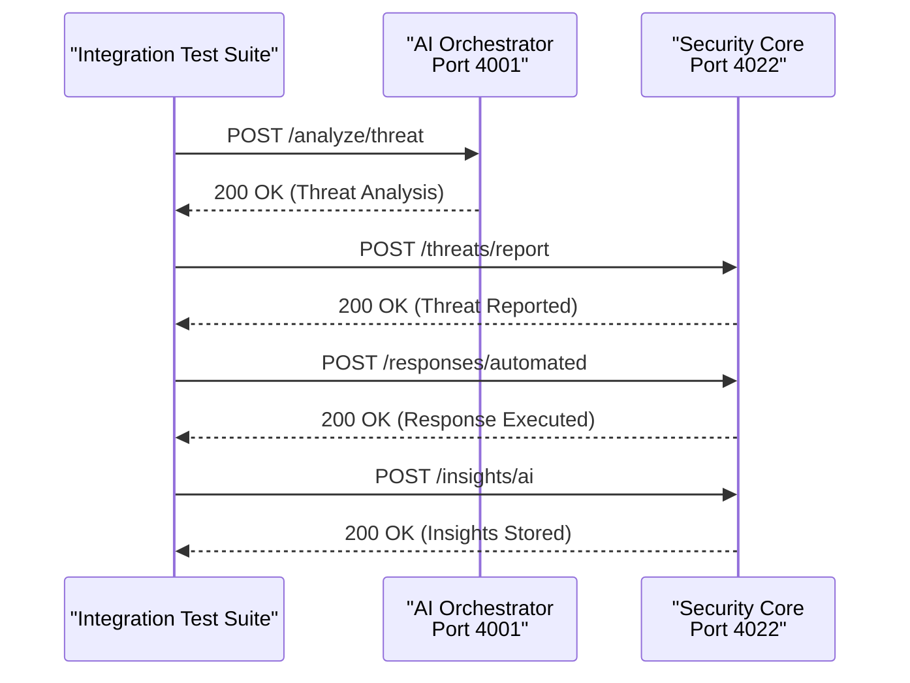
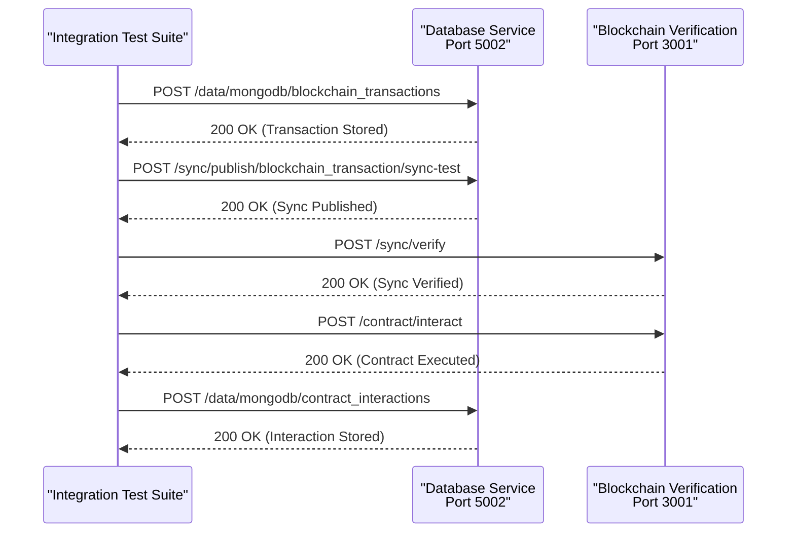
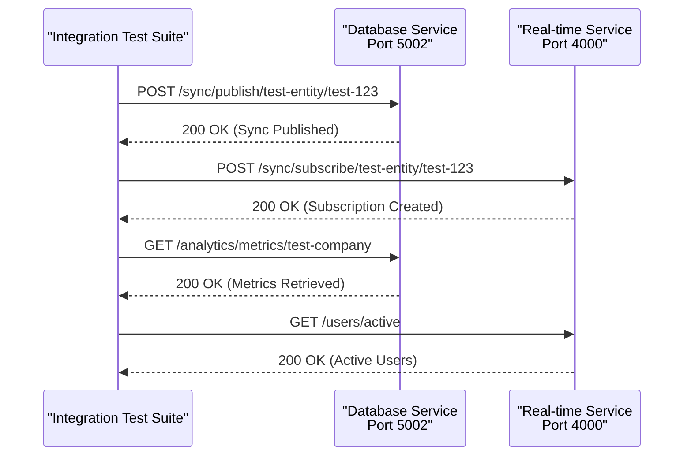
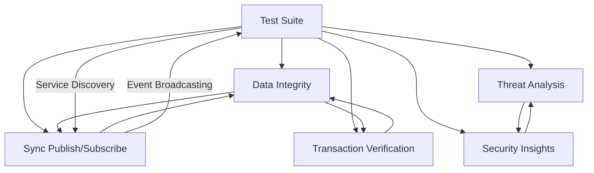

# Integration Testing

<cite>
**Referenced Files in This Document**   
- [ai-security-integration.js](file://tests/integration/ai-security-integration.js)
- [blockchain-database-sync.js](file://tests/integration/blockchain-database-sync.js)
- [database-realtime-sync.js](file://tests/integration/database-realtime-sync.js)
- [multi-service-communication.js](file://tests/integration/multi-service-communication.js)
- [test-runner.js](file://tests/test-runner.js)
- [docker-compose.yml](file://vessels/docker-compose.yml)
- [docker-compose.prod.yml](file://vessels/docker-compose.prod.yml)
</cite>

## Table of Contents
1. [Introduction](#introduction)
2. [Integration Test Suite Overview](#integration-test-suite-overview)
3. [Core Integration Test Types](#core-integration-test-types)
4. [Test Setup and Execution Patterns](#test-setup-and-execution-patterns)
5. [Data Seeding and Test Data Management](#data-seeding-and-test-data-management)
6. [Containerized Testing Environments](#containerized-testing-environments)
7. [Service Dependency Management](#service-dependency-management)
8. [Common Issues and Solutions](#common-issues-and-solutions)
9. [Conclusion](#conclusion)

## Introduction

Integration testing in Azora OS ensures end-to-end validation across microservices, blockchain components, and AI governance systems. The integration test suite located in `tests/integration/` validates multi-service communication, database-realtime synchronization, and compliance checks. These tests verify that disparate components work together as expected in a coordinated system. The framework supports testing complex workflows involving AI-driven security analysis, blockchain transaction verification, and real-time data synchronization. This documentation explains the implementation of integration tests, test setup patterns, data management strategies, and containerized testing environments to ensure reliable system validation.

## Integration Test Suite Overview

The integration test suite in Azora OS provides comprehensive validation of system-wide functionality across microservices. Tests are organized in the `tests/integration/` directory and executed through the central `test-runner.js` that orchestrates the testing process. The suite validates communication between services, data consistency across systems, and compliance with regulatory requirements. Each test file exports a `run()` function that performs specific validation scenarios and returns structured results indicating pass/fail status. The test runner aggregates results from all integration tests and generates comprehensive reports on system health and certification readiness.

**Section sources**
- [test-runner.js](file://tests/test-runner.js#L110-L159)
- [test-runner.js](file://tests/test-runner.js#L260-L309)

## Core Integration Test Types

### AI-Security Integration Testing

The `ai-security-integration.js` test validates the integration between the AI orchestrator and security services. It verifies AI-driven threat detection, automated security responses, and security insights integration. The test confirms that the AI orchestrator (running on port 4001) can analyze potential threats and communicate findings to the security core service (running on port 4022). It simulates threat analysis requests, tests automated response mechanisms like IP blocking, and verifies that AI-generated security insights are properly stored and retrievable through the security service API.



**Diagram sources**
- [ai-security-integration.js](file://tests/integration/ai-security-integration.js#L1-L187)

**Section sources**
- [ai-security-integration.js](file://tests/integration/ai-security-integration.js#L1-L187)

### Blockchain-Database Synchronization Testing

The `blockchain-database-sync.js` test validates the integration between blockchain verification and database services. It ensures transaction verification, data integrity, and cross-chain operations function correctly. The test verifies that blockchain transactions can be stored in the database service (port 5002) and that transaction data is properly synchronized with the blockchain verification service (port 3001). It tests smart contract interactions, data integrity verification using cryptographic hashes, and cross-service transaction synchronization to ensure consistency between on-chain and off-chain data.



**Diagram sources**
- [blockchain-database-sync.js](file://tests/integration/blockchain-database-sync.js#L1-L233)

**Section sources**
- [blockchain-database-sync.js](file://tests/integration/blockchain-database-sync.js#L1-L233)

### Database-Realtime Synchronization Testing

The `database-realtime-sync.js` test validates integration between the database service and real-time service. It ensures data synchronization, real-time updates, and cross-service communication work as expected. The test verifies that data changes in the database service (port 5002) are properly propagated to the real-time service (port 4000) through sync endpoints. It tests subscription mechanisms, event broadcasting, and cross-service data flow to ensure that applications receive immediate updates when data changes occur in the system.



**Diagram sources**
- [database-realtime-sync.js](file://tests/integration/database-realtime-sync.js#L1-L128)

**Section sources**
- [database-realtime-sync.js](file://tests/integration/database-realtime-sync.js#L1-L128)

### Multi-Service Communication Testing

The `multi-service-communication.js` test validates communication and coordination between all Azora OS services. It tests service discovery, inter-service APIs, and system-wide events to ensure seamless integration across the microservices architecture. The test verifies health of all core services (database-integration, real-time, security-core, ai-orchestrator, blockchain-verification) and tests API calls between different services. It validates event broadcasting, service discovery mechanisms, and cross-service data flow to ensure the system operates as a cohesive unit.



**Diagram sources**
- [multi-service-communication.js](file://tests/integration/multi-service-communication.js#L1-L344)

**Section sources**
- [multi-service-communication.js](file://tests/integration/multi-service-communication.js#L1-L344)

## Test Setup and Execution Patterns

Integration tests in Azora OS follow a consistent pattern for setup and execution. Each test file exports a `run()` function that returns a structured results object containing pass/fail status and detailed test outcomes. The test runner (`test-runner.js`) dynamically imports and executes each test file, aggregating results for comprehensive reporting. Tests use the `fetch` API to make HTTP requests to service endpoints, with a 5-second timeout to prevent hanging tests. The framework includes utility functions like `testEndpoint()` to standardize endpoint validation across different test types.

The test execution flow begins with service health checks, followed by integration tests, performance tests, and security tests in sequence. Each integration test performs multiple validation steps, with the overall test passing only when all individual tests succeed. Results are structured with a `passed` boolean, `details` object containing individual test outcomes, and an `error` field for any exceptions. This consistent pattern enables reliable test execution and clear result interpretation.

**Section sources**
- [test-runner.js](file://tests/test-runner.js#L260-L309)
- [test-runner.js](file://tests/test-runner.js#L63-L108)

## Data Seeding and Test Data Management

Integration tests in Azora OS use dynamic test data generation rather than relying on pre-seeded databases. Each test creates its own test data using random values to ensure isolation and repeatability. For example, the blockchain-database sync test generates random transaction hashes, block numbers, and wallet addresses for testing transaction storage and synchronization. This approach prevents test interference and allows tests to be run in any order or in parallel.

While the system includes database seeding scripts like `seed-database.js` for development environments, integration tests do not depend on this seeded data. Instead, they create the specific data needed for each test scenario, ensuring that tests validate the complete data creation and synchronization workflow. This approach provides more comprehensive validation of the system's data handling capabilities and ensures that tests accurately reflect real-world usage patterns.

**Section sources**
- [blockchain-database-sync.js](file://tests/integration/blockchain-database-sync.js#L1-L233)
- [services/azora-scriptorium/scripts/seed-database.js](file://services/azora-scriptorium/scripts/seed-database.js#L0-L82)

## Containerized Testing Environments

Azora OS uses Docker Compose to manage containerized testing environments, ensuring consistent test execution across different development and CI/CD environments. The repository contains multiple Docker Compose configuration files in the `vessels/` directory, including `docker-compose.yml` for general development and `docker-compose.prod.yml` for production-like environments. These configurations define the services needed for integration testing, including database, real-time, AI orchestrator, security core, and blockchain verification services.

The containerized approach ensures that all services run in isolated environments with consistent configurations, eliminating "works on my machine" issues. Each service runs in its own container with defined ports, environment variables, and dependencies, allowing integration tests to interact with services as they would in production. This containerization strategy enables reliable testing of service discovery, inter-service communication, and distributed system behavior.

```mermaid
graph TB
subgraph "Docker Containers"
A[Database Service]
B[Real-time Service]
C[Security Core]
D[AI Orchestrator]
E[Blockchain Verification]
end
F[Test Runner] --> A
F --> B
F --> C
F --> D
F --> E
A < --> B
B < --> C
C < --> D
D < --> E
E < --> A
```

**Diagram sources**
- [vessels/docker-compose.yml](file://vessels/docker-compose.yml)
- [vessels/docker-compose.prod.yml](file://vessels/docker-compose.prod.yml)

**Section sources**
- [vessels/docker-compose.yml](file://vessels/docker-compose.yml)
- [vessels/docker-compose.prod.yml](file://vessels/docker-compose.prod.yml)

## Service Dependency Management

Integration testing in Azora OS addresses service dependency management through a combination of service health checks, configuration management, and graceful error handling. Before executing integration tests, the test runner performs health checks on all required services to ensure they are available and responsive. The `getServiceConfig()` function provides service configuration including ports and endpoints, with fallback to default configurations when service-specific configurations are not available.

The test framework handles missing or unresponsive services gracefully, reporting specific errors rather than failing catastrophically. This approach allows developers to identify exactly which services are causing test failures and address dependency issues systematically. The multi-service communication test specifically validates service discovery mechanisms, ensuring that services can dynamically locate and communicate with each other in the distributed system.

**Section sources**
- [test-runner.js](file://tests/test-runner.js#L203-L261)
- [multi-service-communication.js](file://tests/integration/multi-service-communication.js#L1-L344)

## Common Issues and Solutions

### Service Unavailability

A common issue in integration testing is service unavailability, where required services are not running or responsive. The test framework addresses this by first checking service health and providing clear error messages when services are unreachable. Developers should ensure all required services are running in their containers before executing integration tests.

### Data Consistency Issues

Data consistency issues can occur when synchronization between services fails. The integration tests validate data consistency through cross-service verification, such as confirming that blockchain transactions stored in the database are properly verified by the blockchain service. When inconsistencies are detected, the tests provide detailed information about which verification steps failed.

### Network Timeouts

Network timeouts can occur due to slow service responses or network configuration issues. The test framework uses a 5-second timeout for all HTTP requests, which balances thorough testing with reasonable execution time. If timeouts occur frequently, developers should investigate service performance and network connectivity between containers.

### Configuration Mismatches

Configuration mismatches between test expectations and service configurations can cause test failures. The framework uses a hierarchical configuration approach, first attempting to load service-specific configurations and falling back to default configurations. Developers should ensure that service ports and endpoints in the test configuration match the actual service configurations.

## Conclusion

Integration testing in Azora OS provides comprehensive validation of the system's microservices architecture, ensuring reliable operation across AI, blockchain, and traditional service components. The test suite validates multi-service communication, database-realtime synchronization, and compliance requirements through a structured framework that supports both development and production testing. By using containerized environments, dynamic test data generation, and comprehensive service dependency management, the integration tests provide confidence in the system's end-to-end functionality. This robust testing approach enables reliable deployment and maintenance of the complex Azora OS ecosystem.