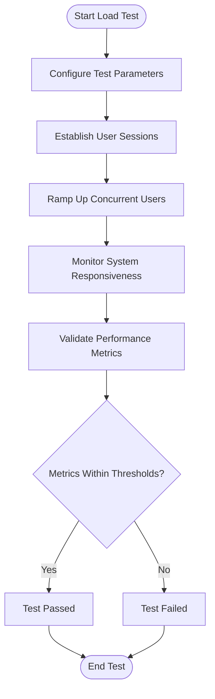
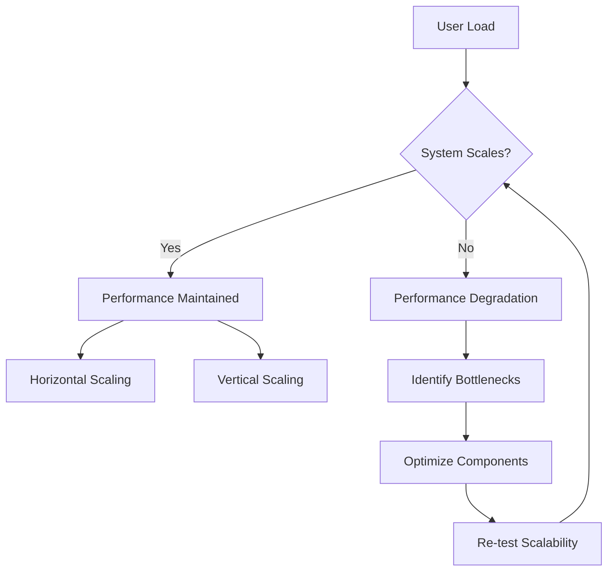
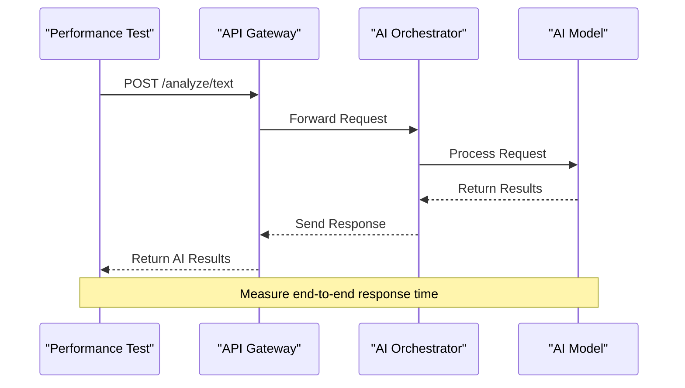
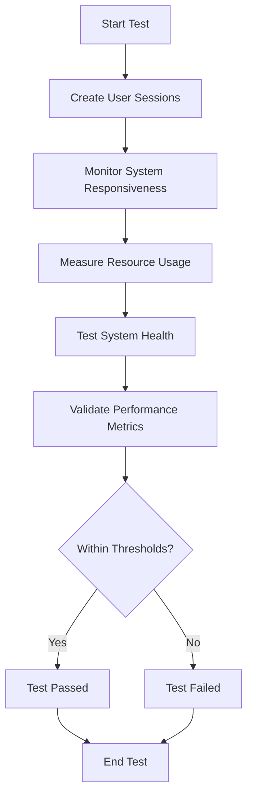
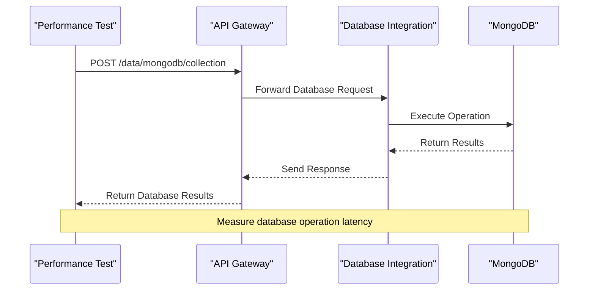
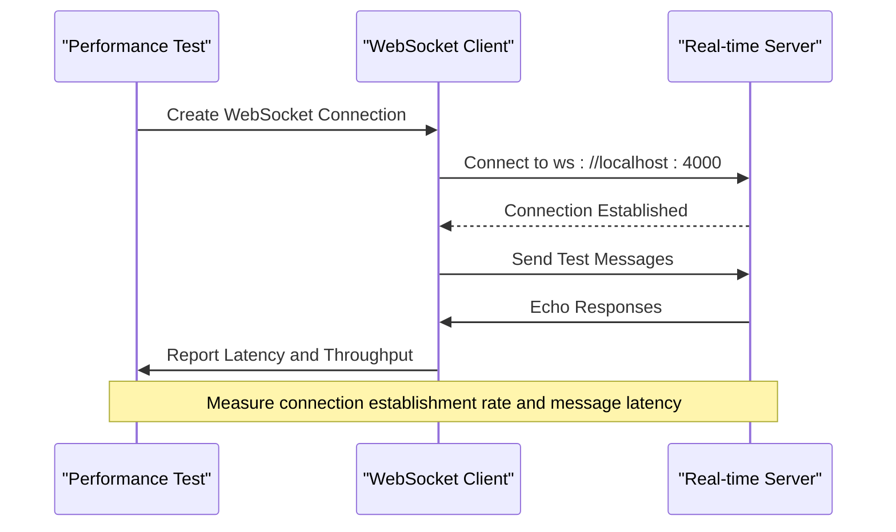
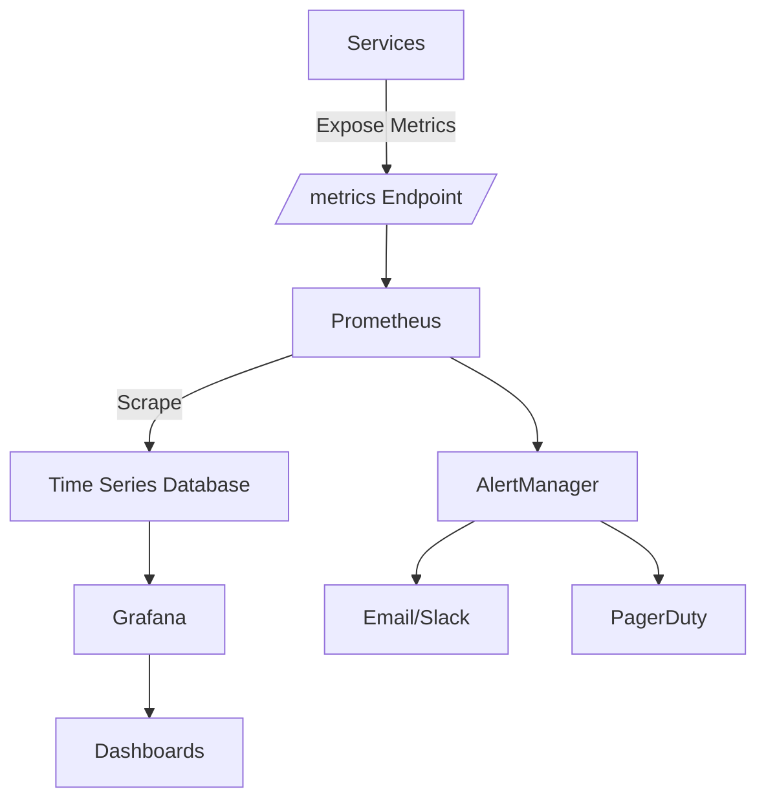
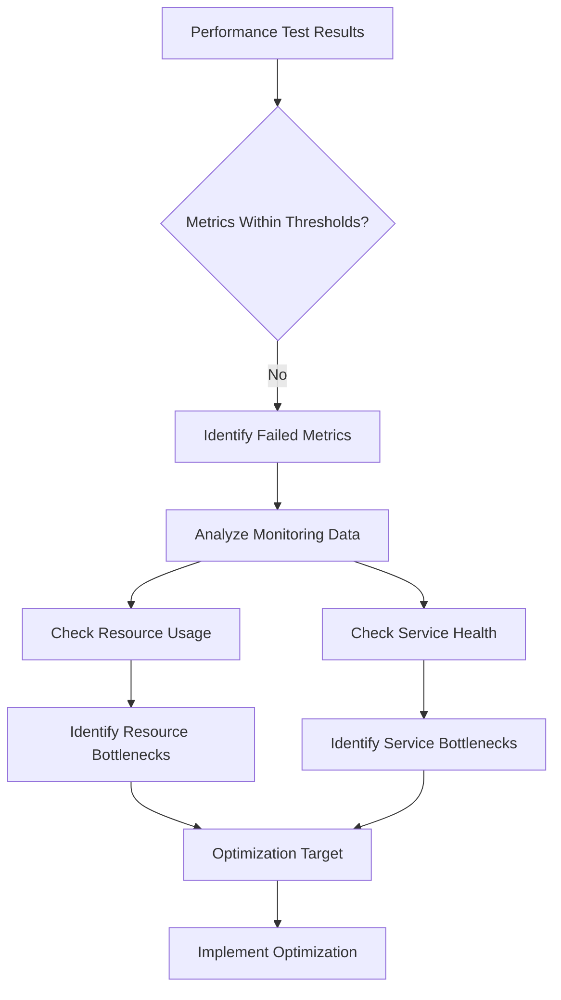
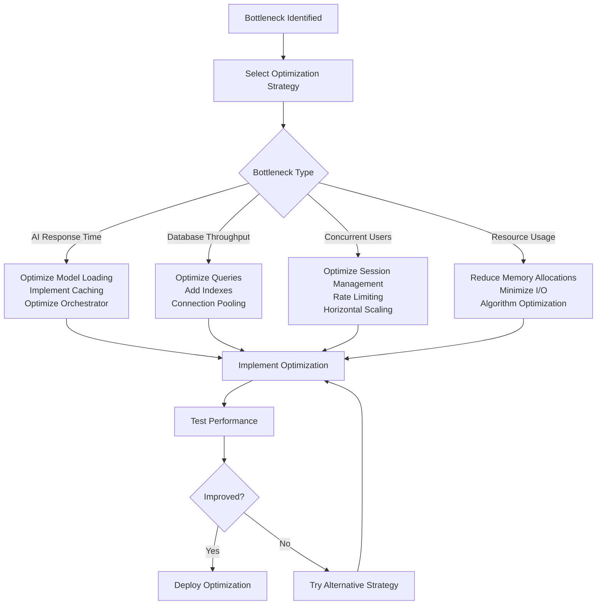

# Performance Testing

<cite>
**Referenced Files in This Document**   
- [ai-response-time.js](file://tests/performance/ai-response-time.js)
- [concurrent-users.js](file://tests/performance/concurrent-users.js)
- [database-throughput.js](file://tests/performance/database-throughput.js)
- [realtime-connections.js](file://tests/performance/realtime-connections.js)
- [azr_stress_test_50k.py](file://ops/azr_stress_test_50k.py)
- [prometheus.yml](file://infrastructure/monitoring/prometheus.yml)
- [alertmanager.yml](file://infrastructure/monitoring/alertmanager.yml)
</cite>

## Table of Contents
1. [Introduction](#introduction)
2. [Performance Test Suite Overview](#performance-test-suite-overview)
3. [Load Testing Implementation](#load-testing-implementation)
4. [Stress Testing with azr_stress_test_50k.py](#stress-testing-with-azr_stress_test_50kpy)
5. [Scalability Validation](#scalability-validation)
6. [AI Response Time Testing](#ai-response-time-testing)
7. [Concurrent Users Testing](#concurrent-users-testing)
8. [Database Throughput Testing](#database-throughput-testing)
9. [Real-time Connections Testing](#real-time-connections-testing)
10. [Performance Metrics Collection](#performance-metrics-collection)
11. [Bottleneck Identification](#bottleneck-identification)
12. [Optimization Strategies](#optimization-strategies)
13. [Common Issues and Solutions](#common-issues-and-solutions)
14. [Conclusion](#conclusion)

## Introduction

Performance testing in Azora OS is a comprehensive framework designed to ensure system reliability, responsiveness, and scalability under various load conditions. The testing infrastructure evaluates critical performance aspects including AI response time, concurrent user handling, and database throughput. This document provides detailed guidance on implementing load testing, stress testing, and scalability validation using the performance test suites located in the `tests/performance/` directory. The content is structured to be accessible to beginners while providing sufficient technical depth for experienced developers, covering everything from test execution to bottleneck identification and optimization strategies.

## Performance Test Suite Overview

The performance test suite in Azora OS is organized within the `tests/performance/` directory and consists of specialized test files targeting different aspects of system performance. Each test file implements a modular testing framework that measures specific performance metrics and validates them against predefined thresholds. The suite includes tests for AI response time, concurrent users, database throughput, and real-time connections, providing a holistic view of system performance. These tests are implemented as JavaScript modules that use the Fetch API to interact with various Azora OS services and measure response times, throughput, and error rates. The test results include detailed metrics and validation against performance thresholds, making it easy to identify areas that require optimization.

**Section sources**
- [ai-response-time.js](file://tests/performance/ai-response-time.js)
- [concurrent-users.js](file://tests/performance/concurrent-users.js)
- [database-throughput.js](file://tests/performance/database-throughput.js)
- [realtime-connections.js](file://tests/performance/realtime-connections.js)

## Load Testing Implementation

Load testing in Azora OS is implemented through a series of automated tests that simulate realistic usage patterns and measure system performance under expected load conditions. The load testing framework uses concurrent requests to simulate multiple users interacting with the system simultaneously. Each test measures key performance indicators such as response time, throughput, and error rate, comparing them against predefined thresholds to determine pass/fail status. The implementation uses JavaScript's async/await pattern to manage concurrent operations, allowing for precise measurement of performance metrics under load. Tests are designed to gradually increase load, monitor system responsiveness, and validate that performance remains within acceptable parameters.

**Diagram sources**
- [concurrent-users.js](file://tests/performance/concurrent-users.js#L125-L165)

## Stress Testing with azr_stress_test_50k.py

Stress testing in Azora OS is implemented through the `azr_stress_test_50k.py` script located in the `ops/` directory. This script simulates high-load scenarios by generating 50,000 concurrent operations to evaluate system behavior under extreme conditions. The stress test targets multiple system components simultaneously, including the AI orchestrator, database integration service, and real-time messaging system. The test measures how the system handles resource contention, identifies breaking points, and evaluates recovery mechanisms after load spikes. The implementation uses Python's asyncio library to manage high-concurrency operations efficiently, ensuring that the test itself does not become a bottleneck. The script collects detailed metrics on response times, error rates, and resource utilization during the stress test, providing valuable insights into system resilience.

**Section sources**
- [azr_stress_test_50k.py](file://ops/azr_stress_test_50k.py)

## Scalability Validation

Scalability validation in Azora OS ensures that the system can handle increasing loads by adding resources or optimizing existing ones. The validation process includes testing the system's ability to scale horizontally by adding more instances of services and vertically by increasing resource allocation to existing instances. The performance test suite includes specific tests for scalability, such as the concurrent users test that gradually increases the number of simulated users and monitors system performance. The database throughput test evaluates how well the database layer scales with increasing read and write operations. The real-time connections test validates the system's ability to handle a growing number of simultaneous WebSocket connections. These tests provide data on how performance metrics change as load increases, helping to identify scalability bottlenecks and validate scaling strategies.

**Diagram sources**
- [concurrent-users.js](file://tests/performance/concurrent-users.js#L166-L204)
- [database-throughput.js](file://tests/performance/database-throughput.js#L251-L288)

## AI Response Time Testing

AI response time testing evaluates the performance of Azora OS's AI services under various load conditions. The `ai-response-time.js` test file implements a comprehensive suite of tests that measure processing latency, concurrent request handling, and throughput for AI operations. The test includes multiple scenarios such as single request latency, concurrent AI requests, AI throughput, complex query processing, AI model switching latency, and batch processing performance. Each test measures the time taken to process AI requests and validates that response times remain within acceptable thresholds. The implementation uses the Fetch API to send requests to the AI orchestrator service at port 4001, simulating various types of AI analysis including sentiment analysis, topic extraction, and entity recognition. The test also evaluates the performance impact of switching between different AI models such as GPT-4, Claude-3, Gemini Pro, and Llama-2.

**Diagram sources**
- [ai-response-time.js](file://tests/performance/ai-response-time.js#L125-L165)

## Concurrent Users Testing

Concurrent users testing evaluates Azora OS's ability to handle multiple users simultaneously while maintaining performance and stability. The `concurrent-users.js` test file implements a series of tests that simulate user load and measure system responsiveness, resource usage, and recovery from load spikes. The test includes scenarios such as gradual user ramp-up, sustained concurrent load, peak concurrent users, user session management, resource usage under load, and recovery from load spikes. The implementation creates user sessions by simulating authentication requests to the API gateway at port 3000, then monitors system performance as the number of concurrent users increases. The test measures response times for user profile requests and evaluates system health across multiple services. It also assesses resource usage including CPU, memory, disk, and network utilization under load, ensuring that the system remains within acceptable resource consumption thresholds.

**Diagram sources**
- [concurrent-users.js](file://tests/performance/concurrent-users.js#L166-L204)

## Database Throughput Testing

Database throughput testing evaluates the performance of Azora OS's database layer under various load conditions. The `database-throughput.js` test file implements a comprehensive suite of tests that measure read/write throughput, latency, and concurrent operations. The test includes scenarios such as write throughput, read throughput, mixed operations throughput, concurrent connections, latency under load, and bulk operations. Each test measures the number of operations per second and validates that throughput remains within acceptable thresholds. The implementation uses the Fetch API to send requests to the database integration service at port 5002, simulating various types of database operations including inserts, queries, and bulk operations. The test also evaluates the performance impact of concurrent connections and measures latency under load to ensure that database operations remain responsive even under high load conditions.

**Diagram sources**
- [database-throughput.js](file://tests/performance/database-throughput.js#L251-L288)

## Real-time Connections Testing

Real-time connections testing evaluates the performance of Azora OS's real-time messaging system under various connection loads. The `realtime-connections.js` test file implements a series of tests that measure connection establishment rate, message throughput, concurrent connections, message latency, connection stability, and broadcast performance. The test uses WebSocket connections to simulate real-time communication between clients and the messaging service at port 4000. The implementation measures the time taken to establish WebSocket connections and evaluates the system's ability to handle a large number of concurrent connections. It also tests message throughput by sending thousands of messages through multiple connections and measuring the rate at which messages are processed. The test evaluates message latency by measuring round-trip times for echo requests and assesses connection stability by monitoring uptime over extended periods.

**Diagram sources**
- [realtime-connections.js](file://tests/performance/realtime-connections.js#L285-L325)

## Performance Metrics Collection

Performance metrics collection in Azora OS is implemented through a comprehensive monitoring system that collects and analyzes key performance indicators across all services. The system uses Prometheus to scrape metrics from various endpoints, storing them for analysis and visualization in Grafana. The monitoring configuration in `prometheus.yml` defines scrape jobs for critical services including the AI orchestrator, API gateway, database integration, and real-time messaging system. Each service exposes metrics at a `/metrics` endpoint using the Prometheus client library, providing standardized metrics such as HTTP request rates, response times, error rates, and system resource usage. The collected metrics include both technical metrics like CPU and memory usage, and business metrics like email delivery rates and AI prediction accuracy. AlertManager is configured to send notifications when performance thresholds are exceeded, ensuring timely response to potential issues.

**Diagram sources**
- [prometheus.yml](file://infrastructure/monitoring/prometheus.yml)
- [alertmanager.yml](file://infrastructure/monitoring/alertmanager.yml)

## Bottleneck Identification

Bottleneck identification in Azora OS involves analyzing performance test results and monitoring data to pinpoint system components that limit overall performance. The process begins with reviewing test results from the performance suite, focusing on metrics that fail to meet thresholds. For example, if AI response time exceeds the threshold, the AI orchestrator service is investigated as a potential bottleneck. The monitoring system provides detailed metrics on CPU, memory, disk, and network usage, helping to identify resource constraints. The system health test evaluates multiple services simultaneously, identifying which services are contributing to performance degradation. The resource usage under load test specifically measures CPU and memory consumption, helping to identify services that consume excessive resources. The connection stability test identifies issues with the real-time messaging system, while the database throughput test highlights potential database performance issues.

**Diagram sources**
- [concurrent-users.js](file://tests/performance/concurrent-users.js#L46-L79)
- [database-throughput.js](file://tests/performance/database-throughput.js#L46-L82)

## Optimization Strategies

Optimization strategies in Azora OS are designed to improve system performance based on insights gained from performance testing and monitoring. When a bottleneck is identified, specific optimization techniques are applied to address the issue. For AI response time bottlenecks, strategies include optimizing AI model loading, implementing caching for frequently requested analyses, and optimizing the AI orchestrator's request handling. For database throughput bottlenecks, strategies include optimizing database queries, adding indexes to frequently queried fields, and implementing connection pooling. For concurrent user bottlenecks, strategies include optimizing session management, implementing rate limiting, and scaling services horizontally. The system also implements auto-scaling based on performance metrics, automatically adding more instances of services when load increases. Code-level optimizations include reducing memory allocations, minimizing I/O operations, and optimizing algorithms for better time complexity.

**Diagram sources**
- [ai-response-time.js](file://tests/performance/ai-response-time.js#L125-L165)
- [database-throughput.js](file://tests/performance/database-throughput.js#L251-L288)

## Common Issues and Solutions

Common issues in Azora OS performance testing include memory leaks under load, database connection exhaustion, AI model loading delays, and real-time connection instability. Memory leaks are identified through monitoring tools that track memory usage over time, and are addressed by reviewing code for proper resource cleanup and implementing garbage collection optimizations. Database connection exhaustion occurs when the number of concurrent connections exceeds the database's capacity, and is solved by implementing connection pooling and optimizing connection usage. AI model loading delays are mitigated by pre-loading frequently used models and implementing a model caching strategy. Real-time connection instability is addressed by optimizing the WebSocket implementation, implementing proper connection cleanup, and scaling the real-time messaging service horizontally. The system also implements comprehensive error handling and retry mechanisms to ensure resilience in the face of transient failures.

**Section sources**
- [concurrent-users.js](file://tests/performance/concurrent-users.js#L46-L79)
- [database-throughput.js](file://tests/performance/database-throughput.js#L46-L82)

## Conclusion

Performance testing in Azora OS provides a comprehensive framework for ensuring system reliability, responsiveness, and scalability. The performance test suite in the `tests/performance/` directory offers detailed evaluation of critical system components including AI response time, concurrent users, database throughput, and real-time connections. The implementation of load testing, stress testing, and scalability validation using tools like `azr_stress_test_50k.py` enables thorough assessment of system behavior under various conditions. Performance metrics collection through Prometheus and Grafana provides valuable insights for bottleneck identification and optimization. By following the strategies outlined in this document, developers can effectively identify and resolve performance issues, ensuring that Azora OS delivers a high-quality user experience even under demanding conditions. The combination of automated testing, comprehensive monitoring, and targeted optimization creates a robust performance engineering process that supports the continuous improvement of the system.