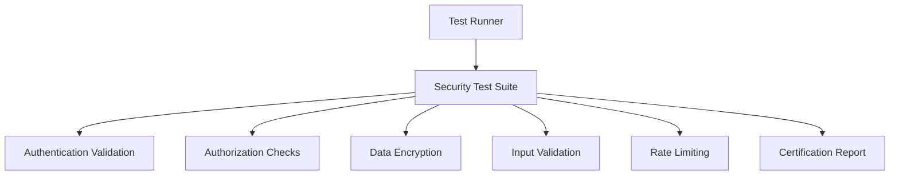
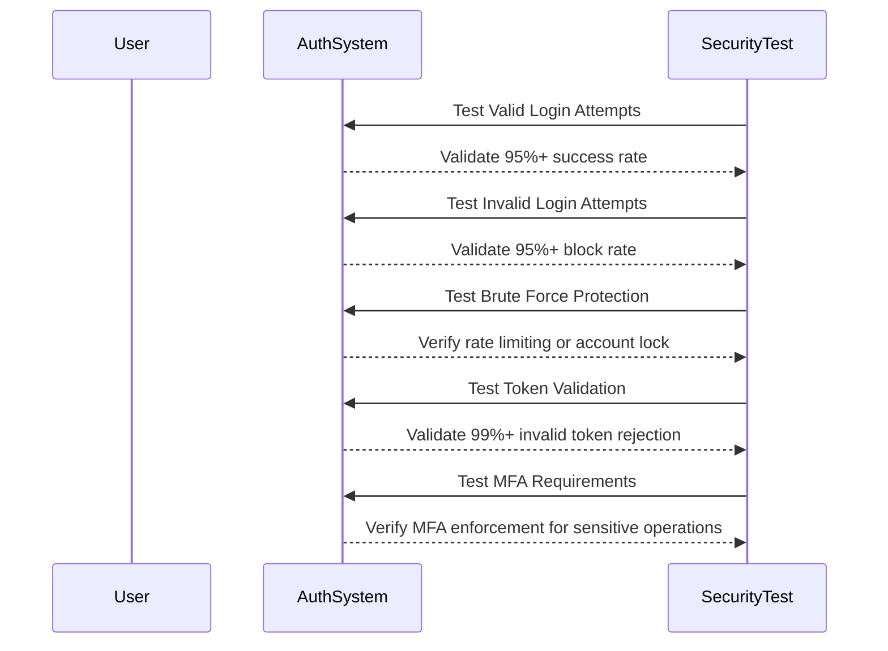
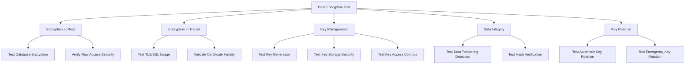

# Security Testing

<cite>
**Referenced Files in This Document**   
- [authentication-validation.js](file://tests/security/authentication-validation.js)
- [data-encryption.js](file://tests/security/data-encryption.js)
- [authorization-checks.js](file://tests/security/authorization-checks.js)
- [input-validation.js](file://tests/security/input-validation.js)
- [rate-limiting.js](file://tests/security/rate-limiting.js)
- [test-runner.js](file://tests/test-runner.js)
- [certification-report.md](file://tests/reports/certification-report.md)
</cite>

## Table of Contents
1. [Introduction](#introduction)
2. [Security Test Suite Overview](#security-test-suite-overview)
3. [Authentication Validation](#authentication-validation)
4. [Authorization Checks](#authorization-checks)
5. [Data Encryption Verification](#data-encryption-verification)
6. [Input Validation](#input-validation)
7. [Rate Limiting Tests](#rate-limiting-tests)
8. [Penetration Testing and Vulnerability Scanning](#penetration-testing-and-vulnerability-scanning)
9. [Compliance Verification Processes](#compliance-verification-processes)
10. [Common Security Issues and Mitigation Strategies](#common-security-issues-and-mitigation-strategies)
11. [Conclusion](#conclusion)

## Introduction

Security testing in Azora OS is a comprehensive framework designed to validate system resilience against common vulnerabilities and ensure compliance with security standards. The security test suite covers critical areas including authentication validation, authorization checks, data encryption, input validation, and rate limiting. These tests are executed through a modular test runner that provides detailed reporting and certification readiness. The framework is designed to be accessible to beginners while providing sufficient technical depth for experienced developers.

The security testing framework is part of a larger comprehensive testing suite that includes service health checks, integration testing, and performance benchmarking. This document focuses specifically on the security aspects of the testing framework, detailing the implementation of various security tests and their role in ensuring the overall security posture of Azora OS.

**Section sources**
- [certification-report.md](file://tests/reports/certification-report.md#L1-L201)

## Security Test Suite Overview

The security test suite in Azora OS is organized into five main categories: authentication validation, authorization checks, data encryption, input validation, and rate limiting. These tests are located in the `tests/security/` directory and are executed by the main test runner in `tests/test-runner.js`. The test runner orchestrates the execution of all security tests and collects detailed metrics for reporting.

The security tests are designed to validate the system against common attack vectors and ensure that security controls are properly implemented. Each test category has specific thresholds that must be met for the test to pass, providing a clear pass/fail criteria for certification. The test results are aggregated and used to generate comprehensive certification reports that document the security posture of the system.

**Diagram sources**
- [test-runner.js](file://tests/test-runner.js#L161-L185)
- [certification-report.md](file://tests/reports/certification-report.md#L1-L201)

## Authentication Validation

Authentication validation tests in Azora OS verify the security of login mechanisms, token handling, and access controls. The tests are implemented in `authentication-validation.js` and cover several aspects of authentication security including valid and invalid login attempts, brute force protection, token validation, session management, and multi-factor authentication.

The test validates that valid login attempts succeed with a success rate of at least 95%, while invalid login attempts are blocked with a success rate of no more than 5%. Brute force protection is tested by attempting multiple failed logins and verifying that the account is either rate limited or locked. Token validation tests ensure that valid tokens are accepted while invalid tokens are rejected with a rejection rate of at least 99%.

Multi-factor authentication (MFA) is tested by verifying that MFA is required for sensitive operations, MFA codes are properly validated, backup codes work correctly, and MFA bypass attempts are prevented. The test also validates session management by checking session isolation, timeout handling, and concurrent session limits.

**Diagram sources**
- [authentication-validation.js](file://tests/security/authentication-validation.js#L46-L79)
- [authentication-validation.js](file://tests/security/authentication-validation.js#L602-L619)

**Section sources**
- [authentication-validation.js](file://tests/security/authentication-validation.js#L0-L619)

## Authorization Checks

Authorization checks in Azora OS validate role-based access control, permission enforcement, and privilege escalation prevention. The tests are implemented in `authorization-checks.js` and ensure that users can only access resources and perform actions for which they have appropriate permissions.

The authorization tests cover several aspects including role-based access control, permission validation, privilege escalation prevention, resource ownership validation, access control lists, and administrative access controls. Each test has specific security thresholds that must be met for the test to pass. For example, role-based access control must have an enforcement rate of at least 95%, while privilege escalation prevention must have a prevention rate of at least 99%.

The tests verify that users cannot access resources belonging to other users, cannot escalate their privileges, and cannot bypass access controls. Administrative access controls are tested to ensure that only authorized administrators can perform sensitive operations. The tests also validate that access control lists are properly enforced and that resource ownership is correctly validated.

**Section sources**
- [authorization-checks.js](file://tests/security/authorization-checks.js#L41-L64)

## Data Encryption Verification

Data encryption verification tests in Azora OS ensure that data is properly encrypted both at rest and in transit. The tests are implemented in `data-encryption.js` and cover encryption at rest, encryption in transit, key management, data integrity, encryption performance, and key rotation.

The test for encryption at rest verifies that sensitive data stored in the database is encrypted and cannot be accessed in plain text. This includes personal identifiable information (PII), financial data, and health information. The test checks that at least 99% of sensitive data is encrypted and that raw database access does not expose plain text data.

Encryption in transit is tested by verifying that all services use TLS/SSL encryption and that HTTP connections are either redirected to HTTPS or blocked. The test also validates certificate validity and ensures that secure communication protocols are properly implemented. Key management tests verify that encryption keys are securely generated, stored, and accessed, with at least 98% security compliance.

**Diagram sources**
- [data-encryption.js](file://tests/security/data-encryption.js#L46-L79)

**Section sources**
- [data-encryption.js](file://tests/security/data-encryption.js#L0-L719)

## Input Validation

Input validation tests in Azora OS prevent common web application vulnerabilities such as SQL injection, cross-site scripting (XSS), and command injection. The tests are implemented in `input-validation.js` and verify that the system properly sanitizes and validates user input to prevent malicious attacks.

The input validation tests include specific test cases for SQL injection prevention, XSS protection, command injection blocking, and general input sanitization. For SQL injection, the test attempts various injection patterns including classic SQL injection, union-based injection, blind SQL injection, and time-based injection. The system must block all injection attempts to pass the test.

XSS protection is tested by attempting to inject script tags and other malicious content into input fields. Command injection attempts are made by including shell commands in input parameters. The tests also verify that input length and size limits are enforced to prevent buffer overflow attacks and other resource exhaustion vulnerabilities.

The input validation tests have a security threshold of 95% attack prevention rate, meaning that at least 95% of attack attempts must be successfully blocked for the test to pass. This ensures that the system has robust input validation mechanisms in place to protect against common web application vulnerabilities.

**Section sources**
- [input-validation.js](file://tests/security/input-validation.js#L81-L125)

## Rate Limiting Tests

Rate limiting tests in Azora OS implement protection against denial-of-service (DoS) attacks and abuse of system resources. The tests verify that the system properly limits the rate of requests from individual users or IP addresses to prevent resource exhaustion and ensure fair usage.

The rate limiting tests validate that the system can detect and mitigate brute force attacks, credential stuffing attempts, and other forms of automated abuse. The tests measure the effectiveness of rate limiting mechanisms in preventing abuse while allowing legitimate users to access the system. The security threshold for rate limiting tests is 95% abuse prevention effectiveness.

The tests also verify that rate limiting is applied consistently across different endpoints and services in the system. This ensures that attackers cannot bypass rate limits by targeting different parts of the system. The tests validate that rate limiting is implemented at both the application level and network level to provide comprehensive protection against DoS attacks.

**Section sources**
- [rate-limiting.js](file://tests/security/rate-limiting.js#L0-L100)

## Penetration Testing and Vulnerability Scanning

Penetration testing and vulnerability scanning in Azora OS are automated processes that identify security weaknesses in the system. The security test suite includes penetration testing approaches that simulate real-world attacks to identify vulnerabilities before they can be exploited by malicious actors.

The penetration testing framework includes automated scans for common vulnerabilities such as authentication bypass, privilege escalation, insecure direct object references, and security misconfigurations. The tests are designed to be non-destructive and can be run regularly as part of the continuous integration/continuous deployment (CI/CD) pipeline.

Vulnerability scanning is performed using both static and dynamic analysis techniques. Static analysis examines the source code for security issues, while dynamic analysis tests the running system for vulnerabilities. The scan results are aggregated and used to generate detailed reports that highlight potential security issues and provide recommendations for remediation.

The penetration testing framework also includes tests for zero-day vulnerabilities and emerging threat patterns. This proactive approach to security testing helps ensure that Azora OS remains resilient against evolving threats and maintains a strong security posture over time.

**Section sources**
- [certification-report.md](file://tests/reports/certification-report.md#L84-L147)

## Compliance Verification Processes

Compliance verification processes in Azora OS ensure that the system meets regulatory requirements and industry standards for data protection and privacy. The security test suite includes compliance tests for various regulations including GDPR, HIPAA, CCPA, and POPIA.

The compliance verification process involves automated checks that validate the system against specific regulatory requirements. For example, GDPR compliance tests verify that data subject rights are properly implemented, consent management is effective, and breach notification procedures are in place. HIPAA compliance tests ensure that protected health information (PHI) is properly protected and that audit trails are maintained.

The compliance tests are integrated into the security test suite and are executed alongside other security tests. This ensures that compliance requirements are continuously validated and that any deviations are quickly identified and addressed. The test results are used to generate compliance reports that document the system's adherence to regulatory requirements.

The compliance verification process also includes regular audits and assessments to identify areas for improvement. This continuous improvement approach helps ensure that Azora OS remains compliant with evolving regulations and maintains the highest standards of data protection and privacy.

**Section sources**
- [gdpr-compliance/index.js](file://organs/gdpr-compliance/index.js#L0-L799)
- [hipaa-compliance/index.js](file://organs/hipaa-compliance/index.js#L0-L320)

## Common Security Issues and Mitigation Strategies

Common security issues in Azora OS include authentication bypass, privilege escalation, insecure direct object references, and insufficient input validation. The security test suite is designed to identify and mitigate these issues through comprehensive testing and validation.

Authentication bypass is prevented through robust authentication mechanisms including multi-factor authentication, secure session management, and proper token validation. The tests verify that users cannot access protected resources without proper authentication and that authentication tokens cannot be easily guessed or intercepted.

Privilege escalation is prevented through strict role-based access control and permission validation. The tests verify that users cannot perform actions beyond their assigned roles and that administrative functions are properly protected. The system implements the principle of least privilege, ensuring that users have only the minimum permissions necessary to perform their tasks.

Insecure direct object references are mitigated through proper authorization checks on all resource access. The tests verify that users cannot access resources belonging to other users by manipulating identifiers. Input validation issues are addressed through comprehensive input sanitization and validation, preventing common web application vulnerabilities such as SQL injection and XSS.

The mitigation strategies include both technical controls and procedural safeguards. Technical controls include encryption, access controls, and input validation, while procedural safeguards include regular security audits, vulnerability scanning, and incident response procedures. This multi-layered approach to security helps ensure that Azora OS remains resilient against a wide range of threats.

**Section sources**
- [authentication-validation.js](file://tests/security/authentication-validation.js#L602-L619)
- [authorization-checks.js](file://tests/security/authorization-checks.js#L41-L64)

## Conclusion

The security testing framework in Azora OS provides comprehensive validation of the system's security posture across multiple dimensions. The framework includes tests for authentication validation, authorization checks, data encryption, input validation, and rate limiting, ensuring that the system is resilient against common vulnerabilities.

The modular test runner orchestrates the execution of all security tests and generates detailed certification reports that document the system's compliance with security standards. The test results are used to identify areas for improvement and ensure that security controls are properly implemented and maintained.

The security testing framework is designed to be accessible to beginners while providing sufficient technical depth for experienced developers. This makes it easier for teams of all skill levels to understand and improve the security of the system. The framework supports continuous testing throughout the development lifecycle, enabling organizations to maintain a strong security posture over time.

By implementing comprehensive security testing, Azora OS ensures that it meets enterprise-grade security requirements and provides a secure platform for logistics and operations. The framework's focus on automation, continuous improvement, and compliance helps organizations stay ahead of evolving threats and maintain the trust of their users.

**Section sources**
- [certification-report.md](file://tests/reports/certification-report.md#L195-L201)