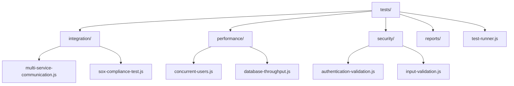
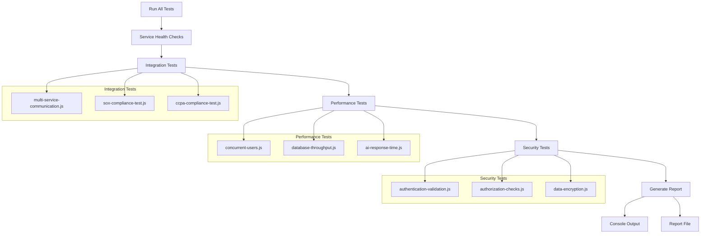
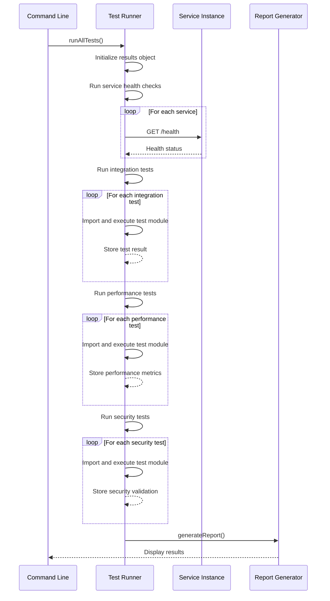
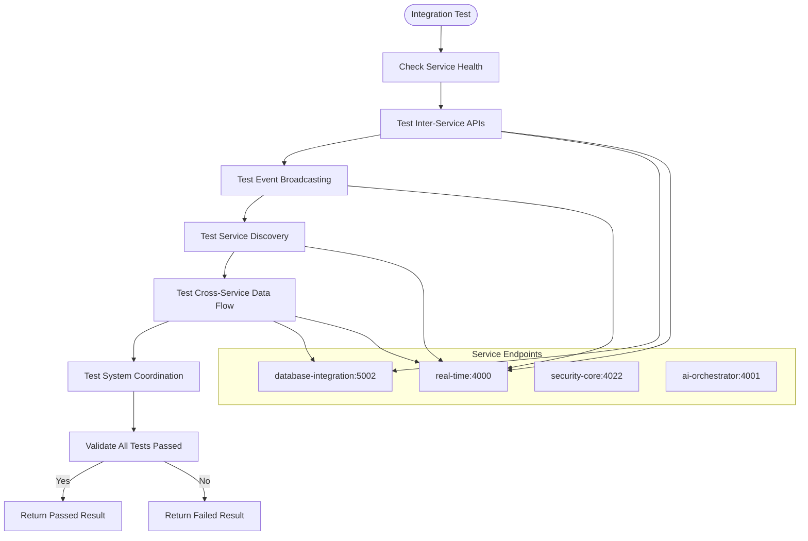
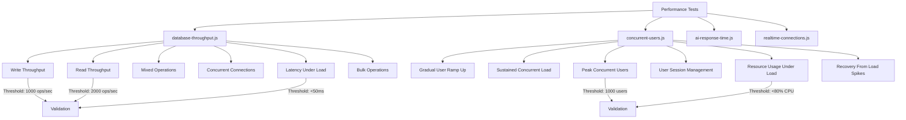
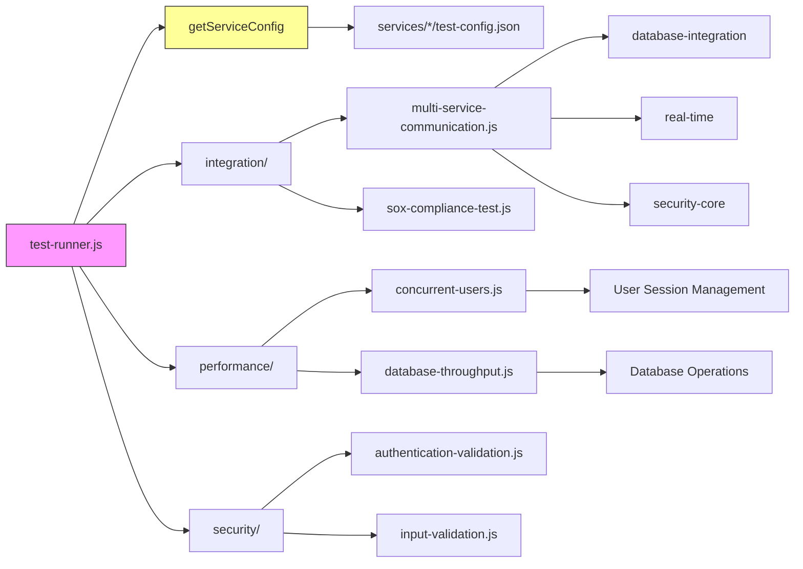

# Testing Strategy

<cite>
**Referenced Files in This Document**   
- [test-runner.js](file://tests/test-runner.js)
- [vitest.config.ts](file://vitest.config.ts)
- [jest.setup.js](file://jest.setup.js)
- [Redemption.test.js](file://test/Redemption.test.js)
- [test-gri.ts](file://test-gri.ts)
- [integration/multi-service-communication.js](file://tests/integration/multi-service-communication.js)
- [performance/concurrent-users.js](file://tests/performance/concurrent-users.js)
- [performance/database-throughput.js](file://tests/performance/database-throughput.js)
- [security/authentication-validation.js](file://tests/security/authentication-validation.js)
- [automated-compliance-reporting/test.js](file://organs/automated-compliance-reporting/test.js)
</cite>

## Table of Contents
1. [Introduction](#introduction)
2. [Project Structure](#project-structure)
3. [Core Components](#core-components)
4. [Architecture Overview](#architecture-overview)
5. [Detailed Component Analysis](#detailed-component-analysis)
6. [Dependency Analysis](#dependency-analysis)
7. [Performance Considerations](#performance-considerations)
8. [Troubleshooting Guide](#troubleshooting-guide)
9. [Conclusion](#conclusion)

## Introduction
The Azora OS testing strategy implements a comprehensive, multi-layered approach to ensure system reliability, security, and performance across its distributed architecture. The framework encompasses unit, integration, end-to-end, performance, and security testing methodologies, with specialized test suites for compliance, AI functionality, and blockchain components. Testing is integrated into the development workflow through automated runners and reporting mechanisms that validate system behavior across services and organizational requirements.

## Project Structure
The testing infrastructure in Azora OS is organized into dedicated directories that categorize tests by type and scope. This structure enables systematic execution and maintenance of test suites across the complex ecosystem of services and compliance requirements.

**Diagram sources**
- [tests/test-runner.js](file://tests/test-runner.js#L1-L500)
- [tests/integration/multi-service-communication.js](file://tests/integration/multi-service-communication.js#L1-L300)

**Section sources**
- [tests/test-runner.js](file://tests/test-runner.js#L1-L500)
- [tests/](file://tests/)

## Core Components
The testing framework in Azora OS centers around the test-runner.js module, which orchestrates the execution of various test categories in a defined sequence. The system implements specialized test suites for integration, performance, and security validation, with results aggregated into comprehensive reports. Configuration management enables service-specific testing parameters, while threshold-based validation ensures performance requirements are met across different load scenarios.

**Section sources**
- [tests/test-runner.js](file://tests/test-runner.js#L1-L500)
- [test-gri.ts](file://test-gri.ts#L1-L400)

## Architecture Overview
The testing architecture in Azora OS follows a hierarchical execution model where different test categories are run in sequence, with results aggregated and reported through a centralized mechanism. The system validates both individual service health and cross-service interactions, ensuring that the distributed nature of the platform maintains consistency and reliability under various conditions.

**Diagram sources**
- [tests/test-runner.js](file://tests/test-runner.js#L1-L500)
- [tests/integration/multi-service-communication.js](file://tests/integration/multi-service-communication.js#L1-L300)
- [tests/performance/concurrent-users.js](file://tests/performance/concurrent-users.js#L1-L300)

## Detailed Component Analysis

### Test Runner Implementation
The test-runner.js module serves as the central orchestrator for the testing framework, executing test suites in a defined sequence and aggregating results for reporting. It implements modular functions for different test categories, allowing for independent execution and maintenance of test types.

**Diagram sources**
- [tests/test-runner.js](file://tests/test-runner.js#L1-L500)
- [tests/test-runner.js](file://tests/test-runner.js#L400-L450)

**Section sources**
- [tests/test-runner.js](file://tests/test-runner.js#L1-L500)

### Integration Testing Framework
The integration testing framework validates cross-service communication and data flow across the Azora OS ecosystem. Tests verify API interactions, event broadcasting, service discovery, and system-wide coordination between components such as database-integration, real-time, and security-core services.

**Diagram sources**
- [tests/integration/multi-service-communication.js](file://tests/integration/multi-service-communication.js#L1-L300)
- [tests/test-runner.js](file://tests/test-runner.js#L260-L309)

**Section sources**
- [tests/integration/multi-service-communication.js](file://tests/integration/multi-service-communication.js#L1-L300)
- [tests/test-runner.js](file://tests/test-runner.js#L260-L309)

### Performance Testing Strategy
The performance testing strategy in Azora OS evaluates system behavior under various load conditions, with specialized tests for database throughput, concurrent user handling, and AI response times. The framework implements threshold-based validation to ensure the system meets performance requirements across different metrics.

**Diagram sources**
- [tests/performance/database-throughput.js](file://tests/performance/database-throughput.js#L1-L300)
- [tests/performance/concurrent-users.js](file://tests/performance/concurrent-users.js#L1-L300)

**Section sources**
- [tests/performance/database-throughput.js](file://tests/performance/database-throughput.js#L1-L300)
- [tests/performance/concurrent-users.js](file://tests/performance/concurrent-users.js#L1-L300)

## Dependency Analysis
The testing framework in Azora OS has dependencies across multiple services and components, with the test-runner.js module serving as the central orchestrator that imports and executes specialized test modules. The system relies on service configurations to determine endpoint availability and port assignments for health checks and integration testing.

**Diagram sources**
- [tests/test-runner.js](file://tests/test-runner.js#L1-L500)
- [tests/integration/multi-service-communication.js](file://tests/integration/multi-service-communication.js#L1-L300)
- [tests/performance/concurrent-users.js](file://tests/performance/concurrent-users.js#L1-L300)

**Section sources**
- [tests/test-runner.js](file://tests/test-runner.js#L1-L500)
- [tests/integration/multi-service-communication.js](file://tests/integration/multi-service-communication.js#L1-L300)

## Performance Considerations
The testing framework is designed to evaluate system performance under various load conditions, with specific thresholds defined for different performance metrics. The concurrent-users.js test evaluates system responsiveness under gradually increasing user loads, sustained concurrent usage, and peak traffic conditions. The database-throughput.js test measures write and read operations per second, concurrent connections, and latency under load. Performance validation includes recovery from load spikes and resource usage monitoring to ensure the system maintains stability and responsiveness.

## Troubleshooting Guide
When tests fail in the Azora OS testing framework, the first step is to examine the detailed error messages and stack traces provided in the test output. Service health check failures typically indicate that a service is not running or its health endpoint is not responding. Integration test failures may point to issues with API endpoints, data formats, or service dependencies. Performance test failures often relate to threshold violations in response times, throughput, or resource utilization. Security test failures require examination of authentication mechanisms, authorization rules, data encryption, and input validation processes.

**Section sources**
- [tests/test-runner.js](file://tests/test-runner.js#L350-L400)
- [test-gri.ts](file://test-gri.ts#L276-L315)
- [organs/automated-compliance-reporting/test.js](file://organs/automated-compliance-reporting/test.js#L343-L373)

## Conclusion
The testing strategy in Azora OS provides a comprehensive framework for validating the reliability, performance, and security of its distributed architecture. By implementing a multi-layered approach that includes service health checks, integration testing, performance evaluation, and security validation, the system ensures that all components function correctly both in isolation and as part of the larger ecosystem. The automated test runner and reporting mechanisms enable consistent validation across development, staging, and production environments, supporting the platform's mission-critical operations and compliance requirements.