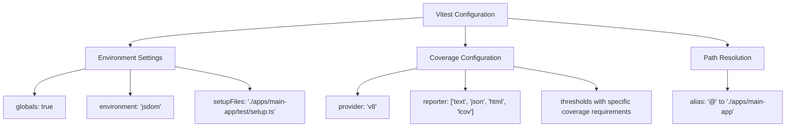
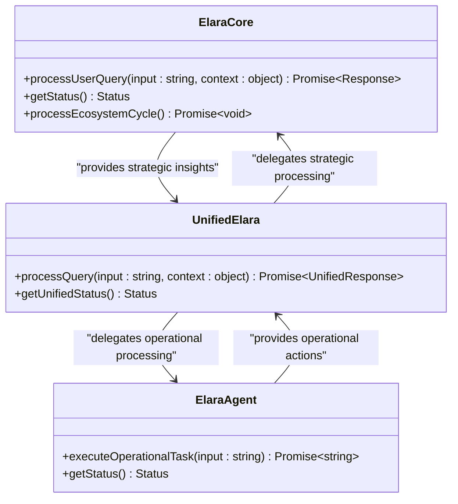
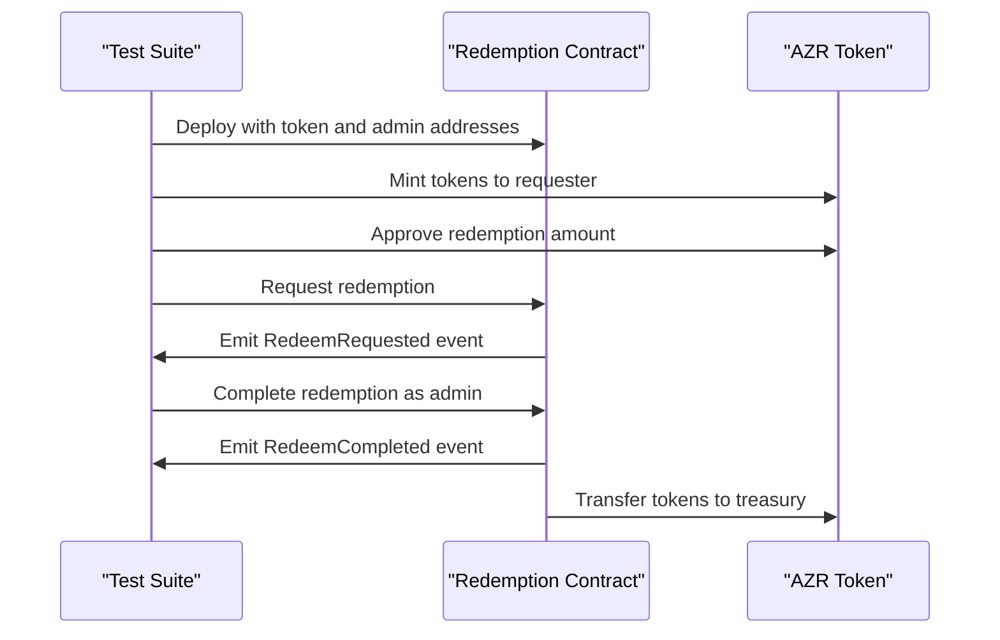
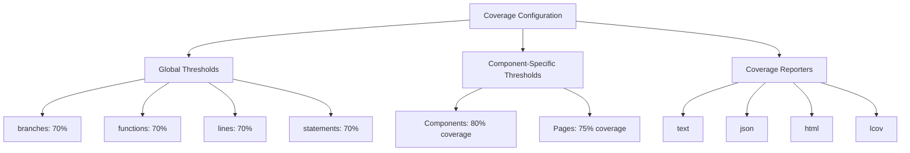

# Unit Testing

<cite>
**Referenced Files in This Document**   
- [vitest.config.ts](file://vitest.config.ts)
- [Redemption.test.js](file://test/Redemption.test.js)
- [unified-elara.test.ts](file://genome/agent-tools/unified-elara.test.ts)
- [test-elara-supreme.ts](file://genome/test-elara-supreme.ts)
- [test-elara.ts](file://genome/test-elara.ts)
</cite>

## Table of Contents
1. [Introduction](#introduction)
2. [Vitest Configuration](#vitest-configuration)
3. [Core Testing Components](#core-testing-components)
4. [Testing AI Components](#testing-ai-components)
5. [Blockchain Interaction Testing](#blockchain-interaction-testing)
6. [Test Coverage and Quality Standards](#test-coverage-and-quality-standards)
7. [Best Practices for Unit Testing](#best-practices-for-unit-testing)
8. [Common Issues and Solutions](#common-issues-and-solutions)
9. [Conclusion](#conclusion)

## Introduction
This document provides comprehensive guidance on unit testing within Azora OS, focusing on the implementation using Vitest as the primary test runner. The content covers configuration options, best practices for testing various components including AI systems and blockchain interactions, and strategies for maintaining reliable tests. The documentation is designed to be accessible to beginners while providing sufficient technical depth for experienced developers working with the Azora ecosystem.

## Vitest Configuration

The Vitest configuration in Azora OS is defined in the `vitest.config.ts` file, which sets up the testing environment with specific parameters for the project's needs. The configuration includes essential settings for test execution, environment setup, and coverage reporting.

**Diagram sources**
- [vitest.config.ts](file://vitest.config.ts#L1-L67)

**Section sources**
- [vitest.config.ts](file://vitest.config.ts#L1-L67)

## Core Testing Components

The unit testing framework in Azora OS includes several core components that work together to ensure comprehensive test coverage. These components include configuration files, test runners, and specialized testing utilities that support the unique requirements of the platform.

The testing strategy emphasizes isolated unit tests that verify individual components without dependencies on external systems. This approach ensures fast execution and reliable results, making it easier to identify and fix issues during development.

**Section sources**
- [vitest.config.ts](file://vitest.config.ts#L1-L67)
- [test-runner.js](file://tests/test-runner.js)

## Testing AI Components

### Elara AI Component Testing

The Elara AI components in Azora OS are tested using a comprehensive integration testing approach that validates both individual system functionality and unified intelligence processing. The tests verify strategic planning, operational execution, and ethical alignment capabilities.

**Diagram sources**
- [unified-elara.test.ts](file://genome/agent-tools/unified-elara.test.ts#L1-L174)
- [test-elara-supreme.ts](file://genome/test-elara-supreme.ts#L1-L241)

The Elara AI testing framework includes several key test categories:
- Individual system tests for Elara Core and Elara Agent
- Unified system tests that validate combined strategic and operational processing
- System status tests that verify component health and capabilities
- Error handling tests that ensure graceful degradation
- Mode-specific tests for different operational contexts

**Section sources**
- [unified-elara.test.ts](file://genome/agent-tools/unified-elara.test.ts#L1-L174)
- [test-elara-supreme.ts](file://genome/test-elara-supreme.ts#L1-L241)
- [test-elara.ts](file://genome/test-elara.ts#L1-L105)

## Blockchain Interaction Testing

### Redemption Contract Testing

The blockchain interactions in Azora OS are tested using Hardhat and Vitest to ensure the reliability and security of smart contract functionality. The Redemption contract serves as a key example of how blockchain components are validated.

**Diagram sources**
- [Redemption.test.js](file://test/Redemption.test.js#L1-L88)

The Redemption contract tests validate several critical aspects:
- Correct deployment with proper parameters
- Ability to request redemptions with appropriate event emission
- Admin authorization for completing redemptions
- Proper token transfer mechanics
- Rejection of unauthorized completion attempts

**Section sources**
- [Redemption.test.js](file://test/Redemption.test.js#L1-L88)

## Test Coverage and Quality Standards

The test coverage configuration in Azora OS enforces strict quality standards to ensure comprehensive test coverage across the codebase. The coverage thresholds are defined in the `vitest.config.ts` file and vary by component type.

**Diagram sources**
- [vitest.config.ts](file://vitest.config.ts#L1-L67)

The coverage configuration excludes certain files and directories that don't require test coverage, such as:
- Node modules
- Test files themselves
- Type definition files
- Configuration files
- Third-party service implementations
- Infrastructure components

**Section sources**
- [vitest.config.ts](file://vitest.config.ts#L1-L67)

## Best Practices for Unit Testing

### Isolation and Mocking Strategies

The unit testing approach in Azora OS emphasizes isolated testing with careful consideration of dependencies. The framework follows a strict "No Mock Protocol" as evidenced by the presence of a dedicated validator that scans for mock patterns in the codebase.

For dependencies that cannot be avoided, the testing framework provides several strategies:
- Using Vitest's built-in mocking utilities for external dependencies
- Creating test doubles for complex services
- Utilizing setup files to configure the testing environment
- Implementing dependency injection patterns to facilitate testing

### Assertion Patterns

The testing framework uses consistent assertion patterns across different test types:
- For AI components: validating response structure, confidence levels, and ethical alignment
- For blockchain interactions: verifying event emissions, state changes, and access controls
- For service components: checking return values, error handling, and performance characteristics

### Test Organization

Tests are organized by component type and complexity:
- Unit tests for individual functions and classes
- Integration tests for component interactions
- System tests for end-to-end workflows
- Performance tests for critical operations
- Security tests for vulnerability assessment

**Section sources**
- [vitest.config.ts](file://vitest.config.ts#L1-L67)
- [unified-elara.test.ts](file://genome/agent-tools/unified-elara.test.ts#L1-L174)
- [Redemption.test.js](file://test/Redemption.test.js#L1-L88)

## Common Issues and Solutions

### Flaky Tests

Flaky tests are a common challenge in complex systems like Azora OS. The framework addresses this through several strategies:
- Using deterministic test data and time mocks
- Implementing proper cleanup in afterAll hooks
- Avoiding external dependencies when possible
- Setting appropriate timeouts for asynchronous operations
- Using retry mechanisms for intermittent failures

### Test Performance

To maintain fast test execution, the framework employs several optimization techniques:
- Parallel test execution
- Efficient test setup and teardown
- Caching of expensive operations
- Selective test running based on code changes

### Maintenance of Reliable Tests

The long-term reliability of tests is ensured through:
- Regular refactoring to match code changes
- Comprehensive documentation of test purpose and behavior
- Automated validation of test quality
- Continuous monitoring of test coverage metrics

**Section sources**
- [no-mock-validator.js](file://infrastructure/no-mock-validator.js)
- [vitest.config.ts](file://vitest.config.ts#L1-L67)

## Conclusion

The unit testing framework in Azora OS provides a comprehensive approach to ensuring code quality and reliability across the platform. By leveraging Vitest as the primary test runner and implementing strict quality standards, the framework supports the development of robust AI components, secure blockchain interactions, and reliable service modules.

The testing strategy emphasizes isolation, comprehensive coverage, and maintainability, ensuring that the Azora ecosystem remains stable and secure as it evolves. The documented best practices and solutions to common issues provide valuable guidance for both new and experienced developers working with the platform.