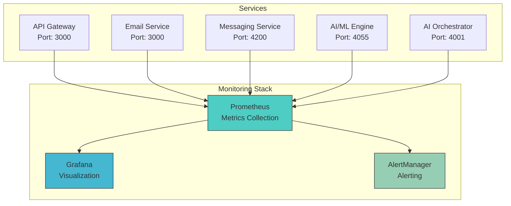
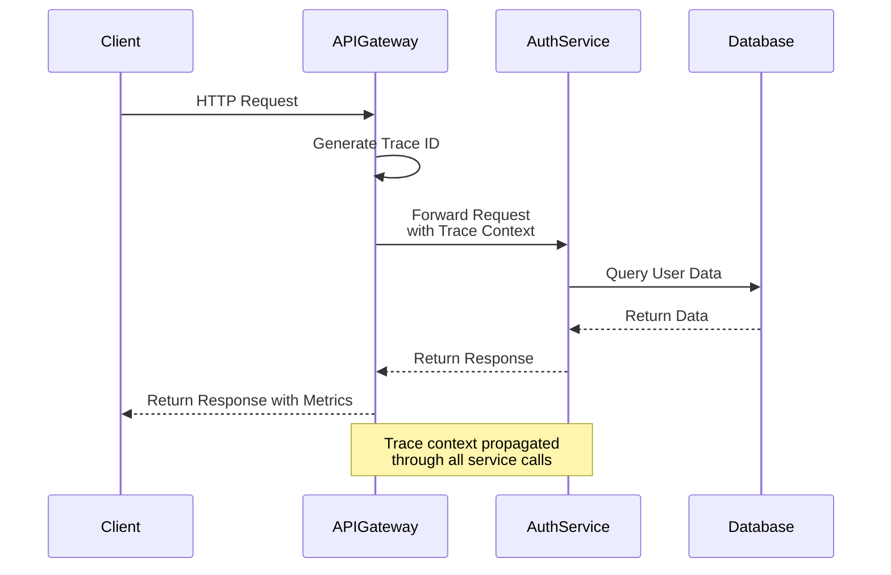
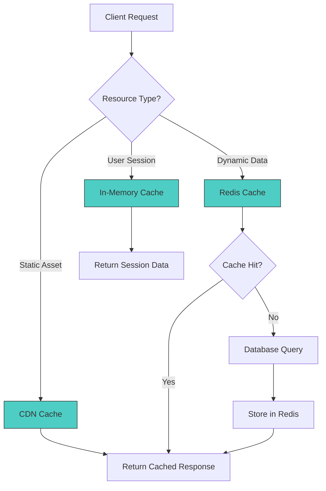
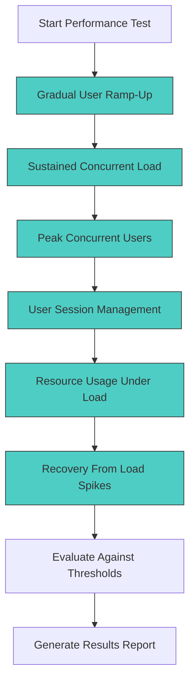

# Performance Issues and Optimization

<cite>
**Referenced Files in This Document**   
- [prometheus.yml](file://infrastructure/monitoring/prometheus.yml)
- [distributed-tracing.js](file://infrastructure/distributed-tracing.js)
- [concurrent-users.js](file://tests/performance/concurrent-users.js)
- [MONITORING.md](file://codex/MONITORING.md)
- [scaling-config.yaml](file://infrastructure/scaling-config.yaml)
- [trace-middleware.js](file://infrastructure/trace-middleware.js)
- [performance-optimizer.js](file://genome/advanced-features/performance-optimizer.js)
- [api-gateway-complete.js](file://infrastructure/api-gateway-complete.js)
</cite>

## Table of Contents
1. [Introduction](#introduction)
2. [Monitoring and Observability Architecture](#monitoring-and-observability-architecture)
3. [Distributed Tracing Implementation](#distributed-tracing-implementation)
4. [Common Performance Issues](#common-performance-issues)
5. [Optimization Techniques](#optimization-techniques)
6. [Load Testing and Capacity Planning](#load-testing-and-capacity-planning)
7. [Conclusion](#conclusion)

## Introduction
This document provides comprehensive guidance on identifying and resolving performance issues in Azora OS. It covers the monitoring infrastructure based on Prometheus and Grafana, distributed tracing capabilities, common performance bottlenecks, and optimization strategies. The document also details load testing procedures using the concurrent-users.js script and provides recommendations for capacity planning based on performance metrics.

## Monitoring and Observability Architecture

Azora OS implements a comprehensive monitoring stack using Prometheus for metrics collection, Grafana for visualization, and AlertManager for alerting. The system collects metrics from all services at regular intervals and exposes them through standardized endpoints.

**Diagram sources**
- [prometheus.yml](file://infrastructure/monitoring/prometheus.yml)
- [MONITORING.md](file://codex/MONITORING.md)

**Section sources**
- [prometheus.yml](file://infrastructure/monitoring/prometheus.yml#L1-L89)
- [MONITORING.md](file://codex/MONITORING.md#L1-L242)

## Distributed Tracing Implementation

Azora OS implements distributed tracing through a dedicated tracing service that captures request flows across microservices. The system uses trace IDs and span IDs to track requests as they propagate through the service mesh, enabling detailed analysis of request performance and failure points.

The tracing infrastructure consists of:
- Trace collector service that stores traces in both Redis (for fast access) and PostgreSQL (for long-term analysis)
- Middleware that automatically captures trace data from incoming requests
- Service mesh registry that defines service dependencies and neighbors
- AI-powered recovery engine that analyzes trace patterns to generate recovery strategies

**Diagram sources**
- [distributed-tracing.js](file://infrastructure/distributed-tracing.js#L1-L629)
- [trace-middleware.js](file://infrastructure/trace-middleware.js#L1-L83)

**Section sources**
- [distributed-tracing.js](file://infrastructure/distributed-tracing.js#L1-L629)
- [trace-middleware.js](file://infrastructure/trace-middleware.js#L1-L83)

## Common Performance Issues

### API Latency
API latency issues in Azora OS typically manifest as increased response times in the API gateway and downstream services. Monitoring data from Prometheus shows that high latency often correlates with increased CPU usage in the AI Orchestrator service and database query times exceeding 500ms.

### Database Query Slowness
Database performance issues are commonly observed in the PostgreSQL database used by multiple services. Slow queries are typically related to missing indexes on frequently queried fields, large result sets, or inefficient query patterns in services like the compliance-dashboard and automated-reporting.

### Blockchain Transaction Delays
Blockchain transaction delays occur primarily in services interacting with the Ethereum network. These delays are often caused by network congestion, insufficient gas prices, or inefficient smart contract calls that require multiple round trips to the blockchain.

### Memory Leaks in Node.js Services
Memory leaks have been identified in several Node.js services, particularly in the AI Orchestrator and API Gateway. These leaks are typically caused by improper event listener cleanup, cached data that grows without bounds, or closures that retain references to large objects.

**Section sources**
- [prometheus.yml](file://infrastructure/monitoring/prometheus.yml#L1-L89)
- [distributed-tracing.js](file://infrastructure/distributed-tracing.js#L1-L629)
- [MONITORING.md](file://codex/MONITORING.md#L1-L242)

## Optimization Techniques

### Query Optimization
Database query optimization in Azora OS involves several strategies:
- Adding appropriate indexes to frequently queried columns
- Implementing query batching to reduce round trips
- Using connection pooling with optimal configuration
- Caching frequently accessed query results in Redis

The system's database configuration supports up to 1000 connections with a pool size of 50, allowing for efficient handling of concurrent database operations.

### Caching Strategies
Azora OS employs a multi-layer caching strategy:
- Redis cluster with 3 shards for distributed caching
- CDN with Cloudflare for static asset delivery
- Browser caching with TTL of 86400 seconds
- In-memory caching for frequently accessed data

The caching configuration is optimized with Redis TTL of 3600 seconds and CDN TTL of 7200 seconds, balancing freshness with performance.

**Diagram sources**
- [scaling-config.yaml](file://infrastructure/scaling-config.yaml#L1-L205)
- [performance-optimizer.js](file://genome/advanced-features/performance-optimizer.js#L1-L448)

### Horizontal Scaling Configurations
The system supports horizontal scaling through Kubernetes Horizontal Pod Autoscaling (HPA) configured for key services:

| Service | Min Replicas | Max Replicas | CPU Target | Memory Target |
|--------|-------------|-------------|------------|---------------|
| Compliance Dashboard | 3 | 20 | 70% | 80% |
| Automated Reporting | 2 | 10 | 60% | 75% |
| Quantum IoT Integration | 3 | 15 | 75% | 85% |

The cluster autoscaling is enabled with a minimum of 3 nodes and maximum of 10 nodes, scaling up when utilization exceeds 80% and scaling down when utilization drops below 30%.

**Section sources**
- [scaling-config.yaml](file://infrastructure/scaling-config.yaml#L1-L205)
- [performance-optimizer.js](file://genome/advanced-features/performance-optimizer.js#L1-L448)

## Load Testing and Capacity Planning

### Load Testing with concurrent-users.js
The concurrent-users.js script provides comprehensive performance testing capabilities for Azora OS. The script executes six test scenarios to evaluate system performance under various load conditions:

1. **Gradual user ramp-up**: Tests system behavior as users gradually increase to 500 concurrent users over 5 minutes
2. **Sustained concurrent load**: Maintains 300 concurrent users for 10 minutes to test stability
3. **Peak concurrent users**: Tests system at peak load of 1000 concurrent users for 2 minutes
4. **User session management**: Evaluates session creation, operation, and termination with 500 sessions
5. **Resource usage under load**: Monitors CPU, memory, disk, and network usage with 200 concurrent users
6. **Recovery from load spikes**: Tests system recovery after a spike from 100 to 600 concurrent users

The script measures response times, error rates, resource utilization, and recovery times, comparing results against predefined performance thresholds.

**Diagram sources**
- [concurrent-users.js](file://tests/performance/concurrent-users.js#L1-L651)

### Interpreting Results for Capacity Planning
Performance test results provide critical data for capacity planning. Key metrics to analyze include:

- **Average response time**: Should remain below 1 second during gradual ramp-up, 1.5 seconds during sustained load, and 2 seconds at peak load
- **Error rate**: Should remain below 10% even at peak concurrent users
- **Resource utilization**: CPU usage should stay below 80% and memory usage below 85% under sustained load
- **Recovery time**: System should recover to baseline performance within 60 seconds after a load spike

Capacity planning decisions should be based on these metrics, with infrastructure scaled horizontally when sustained load tests approach performance thresholds. The system's auto-scaling configuration should be adjusted based on observed performance characteristics in production-like environments.

**Section sources**
- [concurrent-users.js](file://tests/performance/concurrent-users.js#L1-L651)
- [scaling-config.yaml](file://infrastructure/scaling-config.yaml#L1-L205)

## Conclusion
Azora OS provides a comprehensive set of tools and strategies for identifying and resolving performance issues. The integration of Prometheus monitoring, distributed tracing, and automated load testing enables proactive identification of bottlenecks and validation of optimization efforts. By leveraging the described techniques for query optimization, caching, and horizontal scaling, system performance can be significantly improved. Regular load testing with the concurrent-users.js script ensures that the system maintains acceptable performance levels as user demand grows, providing data-driven insights for capacity planning and infrastructure investment.