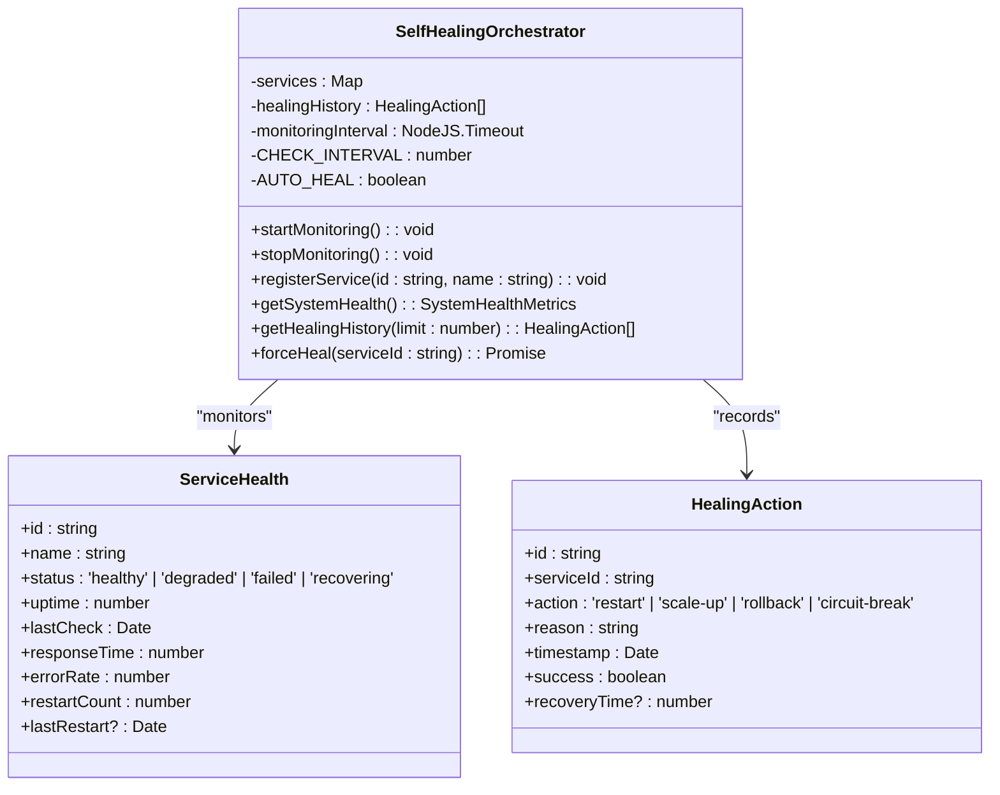
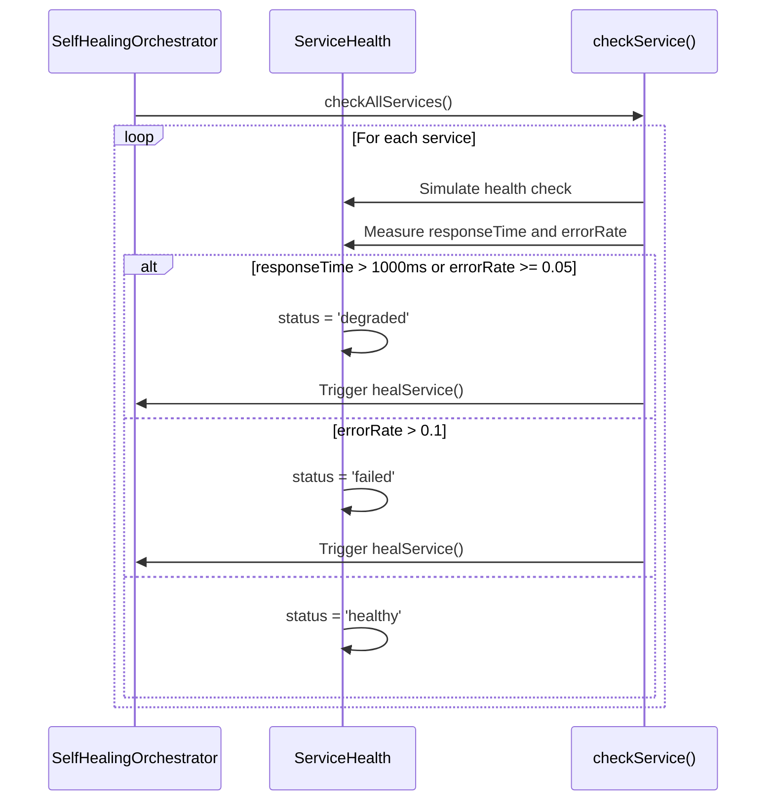
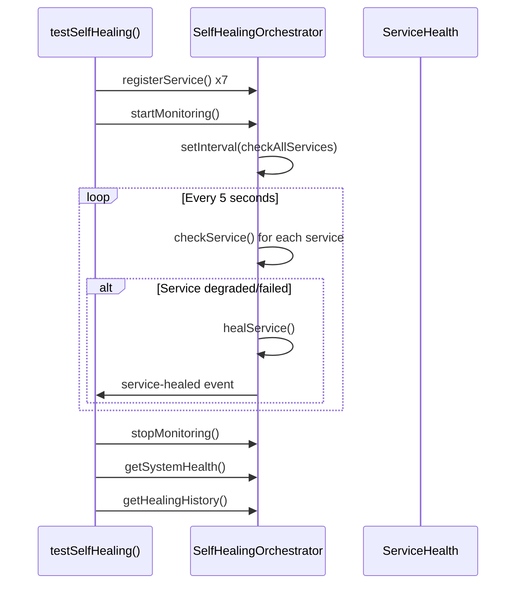

# Self-Healing System Failures

<cite>
**Referenced Files in This Document**   
- [self-healing-orchestrator.ts](file://services/self-healing-orchestrator.ts)
- [test-self-healing.ts](file://scripts/test-self-healing.ts)
- [run-healing-test.bat](file://run-healing-test.bat)
</cite>

## Table of Contents
1. [Introduction](#introduction)
2. [Self-Healing Orchestrator Architecture](#self-healing-orchestrator-architecture)
3. [Health Monitoring and Detection](#health-monitoring-and-detection)
4. [Recovery Action Execution](#recovery-action-execution)
5. [Failure Scenarios and Limitations](#failure-scenarios-and-limitations)
6. [Test Cases and Expected Behavior](#test-cases-and-expected-behavior)
7. [Diagnosing Healing Failures](#diagnosing-healing-failures)
8. [Configuration Issues](#configuration-issues)
9. [Troubleshooting and Recovery](#troubleshooting-and-recovery)
10. [Conclusion](#conclusion)

## Introduction

The Azora OS self-healing system is designed to maintain service availability through autonomous monitoring and recovery mechanisms. The self-healing-orchestrator.ts component continuously monitors service health and automatically triggers recovery actions when failures are detected. This document examines the implementation details, failure scenarios, and troubleshooting procedures for the self-healing system.

**Section sources**
- [self-healing-orchestrator.ts](file://services/self-healing-orchestrator.ts#L1-L55)
- [test-self-healing.ts](file://scripts/test-self-healing.ts#L1-L20)

## Self-Healing Orchestrator Architecture

The SelfHealingOrchestrator class implements a singleton pattern to manage service health monitoring and recovery operations. It uses an event-driven architecture with EventEmitter to notify subscribers of healing events.



**Diagram sources**
- [self-healing-orchestrator.ts](file://services/self-healing-orchestrator.ts#L15-L55)
- [self-healing-orchestrator.ts](file://services/self-healing-orchestrator.ts#L225-L248)

**Section sources**
- [self-healing-orchestrator.ts](file://services/self-healing-orchestrator.ts#L15-L55)

## Health Monitoring and Detection

The orchestrator performs health checks every 5 seconds on registered services. It evaluates service health based on response time and error rate metrics. Services are classified into four states: healthy, degraded, failed, and recovering.



**Diagram sources**
- [self-healing-orchestrator.ts](file://services/self-healing-orchestrator.ts#L102-L144)

**Section sources**
- [self-healing-orchestrator.ts](file://services/self-healing-orchestrator.ts#L102-L144)

## Recovery Action Execution

When a service is detected as degraded or failed, the orchestrator automatically initiates a healing process. The primary recovery action is service restart, which transitions the service through the recovering state before returning to healthy status.

```mermaid
flowchart TD
A[Service Degraded/Failed] --> B{Auto-Heal Enabled?}
B --> |Yes| C[Initiate healService()]
B --> |No| D[Log Failure Only]
C --> E[Set status to 'recovering']
E --> F[Execute restartService()]
F --> G[Wait for recovery]
G --> H[Update Service Metrics]
H --> I[Record Healing Action]
I --> J[Emit service-healed Event]
J --> K[Set status to 'healthy']
```

**Diagram sources**
- [self-healing-orchestrator.ts](file://services/self-healing-orchestrator.ts#L142-L188)

**Section sources**
- [self-healing-orchestrator.ts](file://services/self-healing-orchestrator.ts#L142-L188)

## Failure Scenarios and Limitations

The self-healing mechanism may fail to restore services in several scenarios:

### Misconfigured Health Checks
When health check thresholds are improperly configured, the orchestrator may either fail to detect actual failures or trigger unnecessary healing actions. The current implementation uses fixed thresholds (responseTime < 1000ms and errorRate < 0.05 for healthy status) that may not be appropriate for all service types.

### Resource Exhaustion
If system resources (CPU, memory, disk) are exhausted, restarting services may not resolve the underlying issue. The orchestrator does not currently monitor system-level resource usage that could impact service recovery.

### Cascading Failures
When multiple interdependent services fail simultaneously, healing one service may not be effective if its dependencies remain unavailable. The current implementation treats services independently without considering dependency chains.

**Section sources**
- [self-healing-orchestrator.ts](file://services/self-healing-orchestrator.ts#L102-L144)
- [self-healing-orchestrator.ts](file://services/self-healing-orchestrator.ts#L142-L188)

## Test Cases and Expected Behavior

The test-self-healing.ts script demonstrates the expected behavior of the self-healing system through a 30-second test scenario with multiple registered services.



**Diagram sources**
- [test-self-healing.ts](file://scripts/test-self-healing.ts#L42-L82)

**Section sources**
- [test-self-healing.ts](file://scripts/test-self-healing.ts#L21-L82)

## Diagnosing Healing Failures

When auto-healing fails to trigger or is ineffective, diagnosis should follow these steps:

1. **Verify Service Registration**: Confirm the service is properly registered with the orchestrator
2. **Check Health Status**: Examine the service's current health metrics and status
3. **Review Healing History**: Check for recent healing actions and their outcomes
4. **Validate Configuration**: Ensure AUTO_HEAL is enabled and CHECK_INTERVAL is appropriate

The forceHeal method provides emergency manual healing capability for services that require immediate intervention.

**Section sources**
- [self-healing-orchestrator.ts](file://services/self-healing-orchestrator.ts#L225-L248)
- [self-healing-orchestrator.ts](file://services/self-healing-orchestrator.ts#L50-L108)

## Configuration Issues

Several configuration issues can impact the effectiveness of the self-healing system:

### Auto-Scaler Configuration
The auto-scaler component must be properly configured to work in conjunction with the self-healing orchestrator. Improper scaling policies may conflict with healing actions or exacerbate resource exhaustion issues.

### Auto-Healing Component Settings
Key configuration parameters that affect healing behavior:
- CHECK_INTERVAL: Frequency of health checks (default: 5000ms)
- AUTO_HEAL: Whether automatic healing is enabled (default: true)
- Health thresholds: Response time and error rate thresholds for failure detection

These settings should be tuned based on service characteristics and performance requirements.

**Section sources**
- [self-healing-orchestrator.ts](file://services/self-healing-orchestrator.ts#L50-L108)
- [self-healing-orchestrator.ts](file://services/self-healing-orchestrator.ts#L102-L144)

## Troubleshooting and Recovery

When self-healing capabilities are not functioning as expected, follow these troubleshooting steps:

1. **Verify Orchestrator Status**: Confirm the monitoring interval is active
2. **Check Service Registration**: Ensure services are properly registered
3. **Review Logs**: Examine console output for error messages
4. **Test Manually**: Use forceHeal to verify healing functionality
5. **Validate Dependencies**: Check that all required modules are available

To prevent recurrence:
- Implement monitoring for the orchestrator itself
- Establish alerting for healing failures
- Regularly review and tune health check thresholds
- Document known failure patterns and resolution procedures

**Section sources**
- [self-healing-orchestrator.ts](file://services/self-healing-orchestrator.ts#L225-L248)
- [run-healing-test.bat](file://run-healing-test.bat#L1-L5)

## Conclusion

The Azora OS self-healing system provides robust autonomous recovery capabilities for service failures. By continuously monitoring service health and automatically triggering recovery actions, it maintains system availability with minimal human intervention. However, administrators should be aware of its limitations in handling misconfigured health checks, resource exhaustion, and cascading failures. Proper configuration, monitoring, and troubleshooting procedures are essential to ensure reliable self-healing operations.