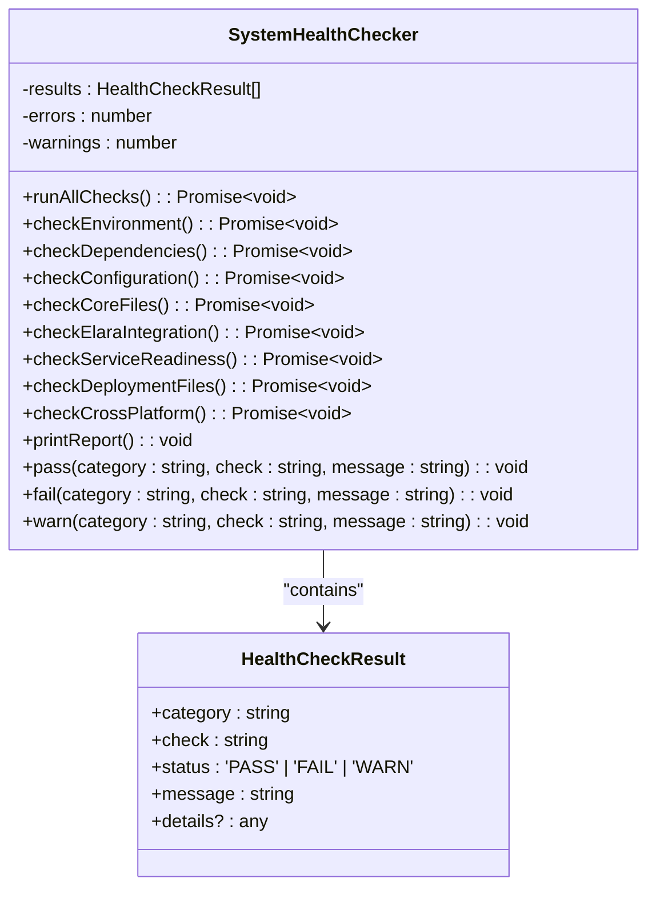
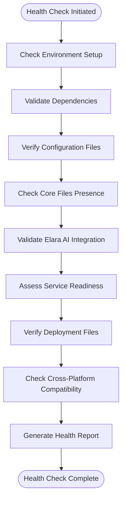
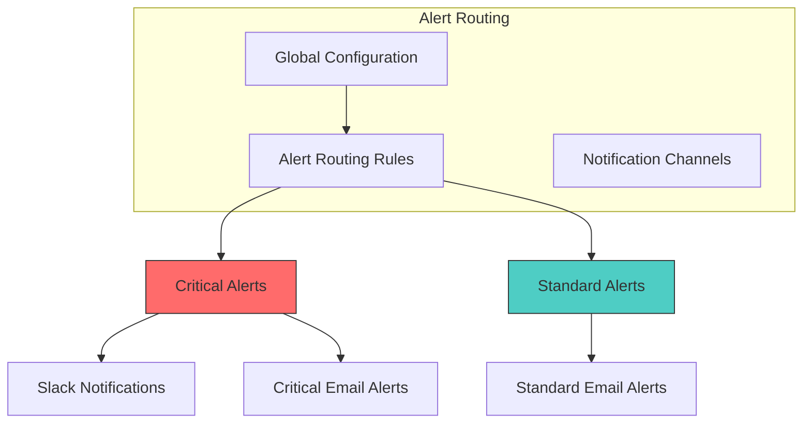
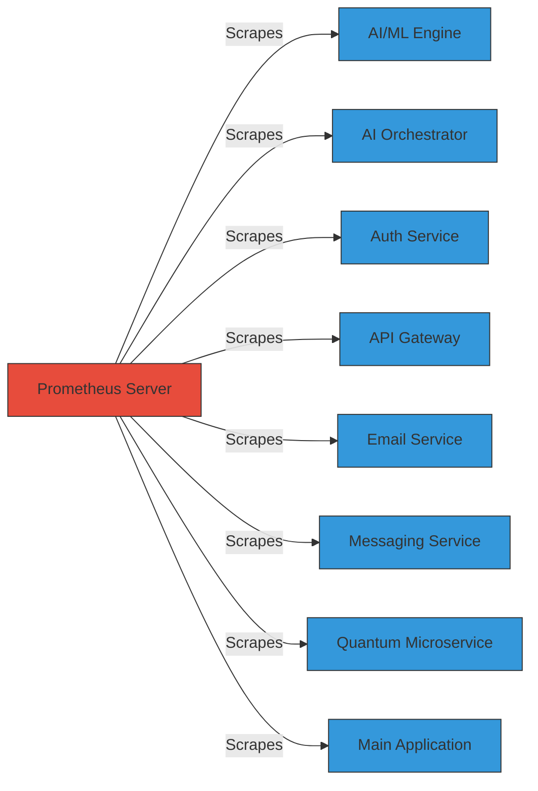
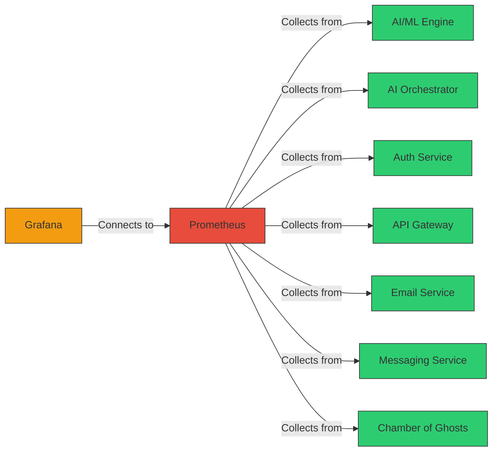
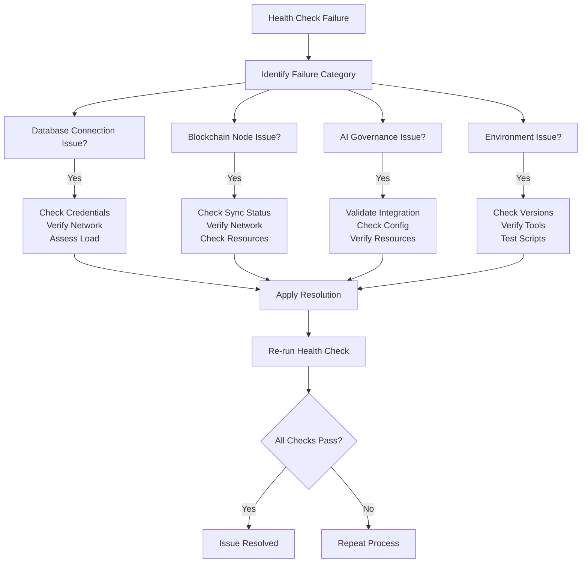
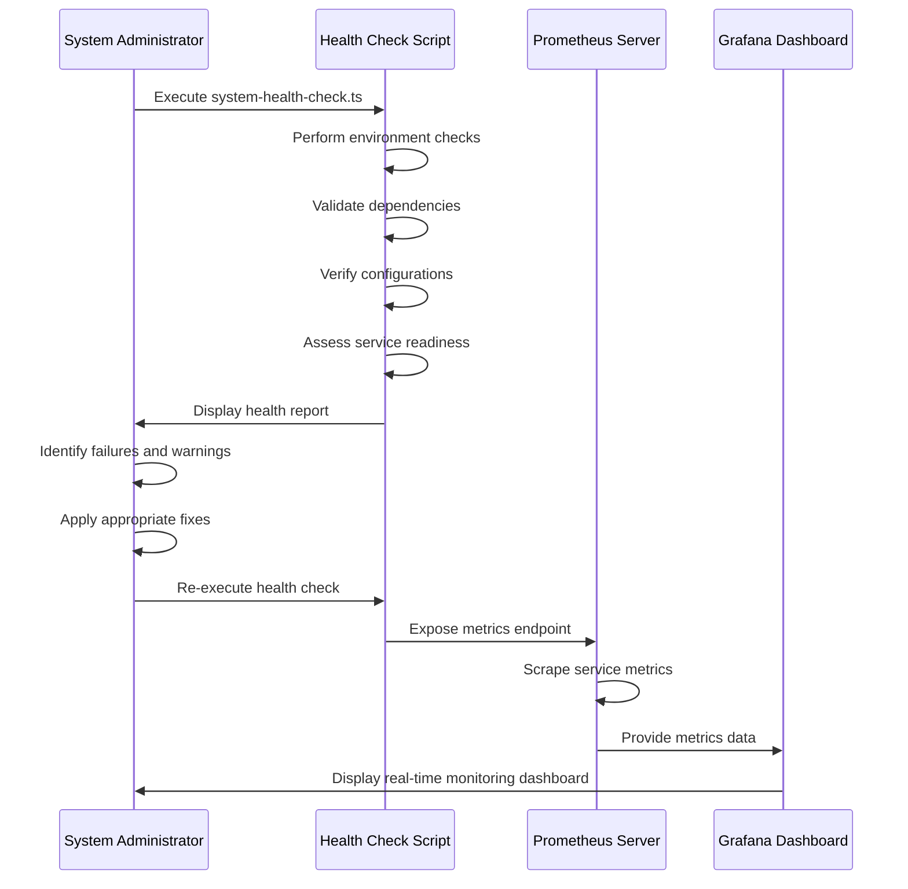

# System Health Monitoring

<cite>
**Referenced Files in This Document**   
- [system-health-check.ts](file://system-health-check.ts)
- [infrastructure/monitoring/prometheus.yml](file://infrastructure/monitoring/prometheus.yml)
- [infrastructure/monitoring/alertmanager.yml](file://infrastructure/monitoring/alertmanager.yml)
- [infrastructure/monitoring/grafana/provisioning/datasources/prometheus.yml](file://infrastructure/monitoring/grafana/provisioning/datasources/prometheus.yml)
- [infrastructure/monitoring/grafana/dashboards/azora-overview.json](file://infrastructure/monitoring/grafana/dashboards/azora-overview.json)
</cite>

## Table of Contents
1. [Introduction](#introduction)
2. [Core Health Check Components](#core-health-check-components)
3. [Health Indicators and Thresholds](#health-indicators-and-thresholds)
4. [Alerting Mechanisms](#alerting-mechanisms)
5. [Prometheus and Grafana Integration](#prometheus-and-grafana-integration)
6. [Interpreting Health Check Outputs](#interpreting-health-check-outputs)
7. [Common Failures and Root Causes](#common-failures-and-root-causes)
8. [Troubleshooting Workflows](#troubleshooting-workflows)
9. [Conclusion](#conclusion)

## Introduction
The System Health Monitoring framework in Azora OS ensures operational integrity across core services including AI governance, blockchain synchronization, and database connectivity. The `system-health-check.ts` script provides a comprehensive verification mechanism for deployment readiness, validating environment setup, dependencies, configurations, service availability, and cross-platform compatibility. This document details the health monitoring architecture, key indicators, alerting systems, and integration with Prometheus and Grafana for real-time observability.

**Section sources**
- [system-health-check.ts](file://system-health-check.ts#L1-L450)

## Core Health Check Components

The `system-health-check.ts` script performs a series of validation checks organized into logical categories. These checks verify the operational status of core system components and ensure deployment readiness.



**Diagram sources**
- [system-health-check.ts](file://system-health-check.ts#L33-L433)

**Section sources**
- [system-health-check.ts](file://system-health-check.ts#L33-L433)

## Health Indicators and Thresholds

The health monitoring system evaluates multiple indicators across different categories, each with specific thresholds for determining system status.

### Environment Health Indicators
- **Node.js Version**: Must be v22 or higher
- **TypeScript**: Must be available and properly installed
- **tsx Runner**: Required for TypeScript execution
- **Git**: Optional but recommended

### Dependency Health Indicators
- **package.json**: Required and must contain critical dependencies
- **Critical Dependencies**: Must include 'next', 'react', 'typescript', 'express', '@langchain/core', 'openai', 'pg', 'ioredis'
- **node_modules**: Directory must exist indicating dependencies are installed

### Configuration Health Indicators
- **Required Files**: tsconfig.json, package.json, tailwind.config.js must be present
- **Optional Files**: .env.production, next.config.js, hardhat.config.ts
- **tsconfig includes**: Must properly include **/*.ts patterns

### Service Readiness Indicators
- **Service Directories**: Must exist for core services
- **Entry Points**: index.ts or index.js must be present in service directories
- **Readiness Threshold**: 70% of services must be ready for system to be considered operational



**Diagram sources**
- [system-health-check.ts](file://system-health-check.ts#L61-L433)

**Section sources**
- [system-health-check.ts](file://system-health-check.ts#L61-L433)

## Alerting Mechanisms

The system implements a multi-level alerting mechanism through integration with Alertmanager, providing notifications for different severity levels.

### Alert Configuration
The Alertmanager configuration defines routing rules and notification channels for different alert severities:



**Diagram sources**
- [infrastructure/monitoring/alertmanager.yml](file://infrastructure/monitoring/alertmanager.yml#L1-L36)

**Section sources**
- [infrastructure/monitoring/alertmanager.yml](file://infrastructure/monitoring/alertmanager.yml#L1-L36)

## Prometheus and Grafana Integration

The monitoring system integrates with Prometheus for metrics collection and Grafana for visualization, providing real-time insights into system health.

### Prometheus Configuration
The Prometheus configuration scrapes metrics from various services at defined intervals:



**Diagram sources**
- [infrastructure/monitoring/prometheus.yml](file://infrastructure/monitoring/prometheus.yml#L1-L90)

### Grafana Dashboard Integration
Grafana is configured to connect to Prometheus as the primary data source:



**Diagram sources**
- [infrastructure/monitoring/grafana/provisioning/datasources/prometheus.yml](file://infrastructure/monitoring/grafana/provisioning/datasources/prometheus.yml#L1-L9)

## Interpreting Health Check Outputs

The health check script produces a comprehensive report that can be interpreted to assess system status and identify issues.

### Sample Health Check Output
```
🏥 AZORA OS SYSTEM HEALTH CHECK
==================================================

📋 Checking Environment...
   ✅ Node.js Version: v22.1.0 (>=22 required)
   ✅ TypeScript: Version 5.4.5
   ✅ tsx Runner: Available
   ⚠️  Git: Not available (optional)

📦 Checking Dependencies...
   ✅ package.json: Found (42 deps)
   ✅ next: v14.1.0
   ✅ react: v18.2.0
   ✅ typescript: v5.4.5
   ✅ express: v4.18.2
   ✅ @langchain/core: v0.1.21
   ✅ openai: v4.24.2
   ✅ pg: v8.11.3
   ✅ ioredis: v5.3.2
   ✅ node_modules: Installed

⚙️  Checking Configuration...
   ✅ tsconfig.json: Present
   ✅ package.json: Present
   ⚠️  .env.production: Missing (optional)
   ✅ tailwind.config.js: Present
   ⚠️  next.config.js: Missing (optional)
   ⚠️  hardhat.config.ts: Missing (optional)
   ✅ tsconfig includes: Properly configured
```

### Health Status Interpretation
The system uses a three-tier status system:
- **PASS (✅)**: Component is functioning correctly
- **WARN (⚠️)**: Component has issues but system can continue
- **FAIL (❌)**: Critical component failure requiring immediate attention

The final report includes a deployment readiness assessment based on the health check results:
- **All Systems Operational**: No failures or warnings
- **System Ready with Warnings**: No failures but some warnings present
- **Critical Issues Found**: Failures detected, system not ready for deployment

**Section sources**
- [system-health-check.ts](file://system-health-check.ts#L350-L433)

## Common Failures and Root Causes

The health monitoring system identifies several common failure scenarios that can impact system operation.

### Database Connection Issues
- **Root Causes**: 
  - Incorrect database credentials
  - Network connectivity problems
  - Database server overload
  - Connection pool exhaustion
- **Detection**: Missing 'pg' dependency or failed database service checks

### Blockchain Node Disconnections
- **Root Causes**:
  - Network instability
  - Node synchronization issues
  - Resource constraints on node
  - Configuration errors
- **Detection**: Failed service readiness checks for blockchain-related services

### AI Governance Failures
- **Root Causes**:
  - Missing Elara AI integration
  - Incorrect model configurations
  - Insufficient computational resources
  - Training data issues
- **Detection**: Elara integration checks failing or service readiness issues

### Environment Compatibility Problems
- **Root Causes**:
  - Incorrect Node.js version
  - Missing TypeScript compiler
  - Platform-specific script incompatibilities
  - Path handling issues
- **Detection**: Environment checks failing, particularly on cross-platform compatibility



**Diagram sources**
- [system-health-check.ts](file://system-health-check.ts#L61-L433)

**Section sources**
- [system-health-check.ts](file://system-health-check.ts#L61-L433)

## Troubleshooting Workflows

When health check failures occur, systematic troubleshooting workflows can restore system health.

### General Troubleshooting Approach
1. **Review Health Check Report**: Identify failed and warning checks
2. **Prioritize Critical Failures**: Address FAIL status items first
3. **Check Dependencies**: Verify all required packages are installed
4. **Validate Configuration**: Ensure all required configuration files exist
5. **Verify Service Readiness**: Confirm core services are available
6. **Re-run Health Check**: Validate that issues have been resolved

### Specific Troubleshooting Procedures

#### For Environment Issues
- Update Node.js to v22 or higher if version is insufficient
- Install TypeScript if not available: `npm install -g typescript`
- Install tsx if not available: `npm install -g tsx`
- Install Git if desired for version control

#### For Dependency Issues
- Run `npm install` to install missing dependencies
- Verify package.json contains required dependencies
- Check for version compatibility issues
- Clear npm cache if installation problems persist

#### For Configuration Issues
- Create missing required configuration files
- Verify tsconfig.json includes proper file patterns
- Check file permissions and accessibility
- Validate JSON syntax in configuration files

#### For Service Readiness Issues
- Verify service directories exist
- Ensure entry point files (index.ts/index.js) are present
- Check service-specific configuration
- Validate service dependencies are met



**Diagram sources**
- [system-health-check.ts](file://system-health-check.ts#L1-L450)
- [infrastructure/monitoring/prometheus.yml](file://infrastructure/monitoring/prometheus.yml#L1-L90)
- [infrastructure/monitoring/grafana/provisioning/datasources/prometheus.yml](file://infrastructure/monitoring/grafana/provisioning/datasources/prometheus.yml#L1-L9)

**Section sources**
- [system-health-check.ts](file://system-health-check.ts#L1-L450)

## Conclusion
The System Health Monitoring framework in Azora OS provides comprehensive oversight of core services through the `system-health-check.ts` script. This system evaluates critical components including AI governance, blockchain synchronization, and database connectivity, ensuring operational integrity before deployment. Integrated with Prometheus and Grafana, the monitoring system offers real-time visibility into service health, with configurable alerting for prompt issue resolution. By following the documented troubleshooting workflows, administrators can efficiently diagnose and resolve common failures, maintaining system stability and reliability.

**Section sources**
- [system-health-check.ts](file://system-health-check.ts#L1-L450)
- [infrastructure/monitoring/prometheus.yml](file://infrastructure/monitoring/prometheus.yml#L1-L90)
- [infrastructure/monitoring/alertmanager.yml](file://infrastructure/monitoring/alertmanager.yml#L1-L36)
- [infrastructure/monitoring/grafana/provisioning/datasources/prometheus.yml](file://infrastructure/monitoring/grafana/provisioning/datasources/prometheus.yml#L1-L9)
- [infrastructure/monitoring/grafana/dashboards/azora-overview.json](file://infrastructure/monitoring/grafana/dashboards/azora-overview.json#L1-L144)