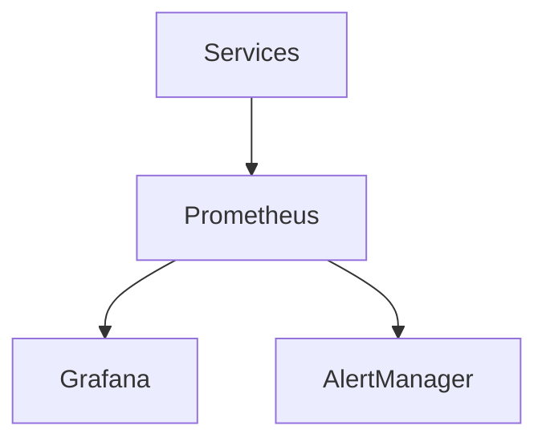
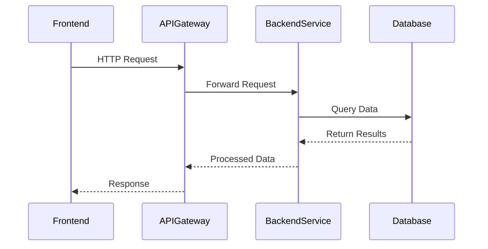
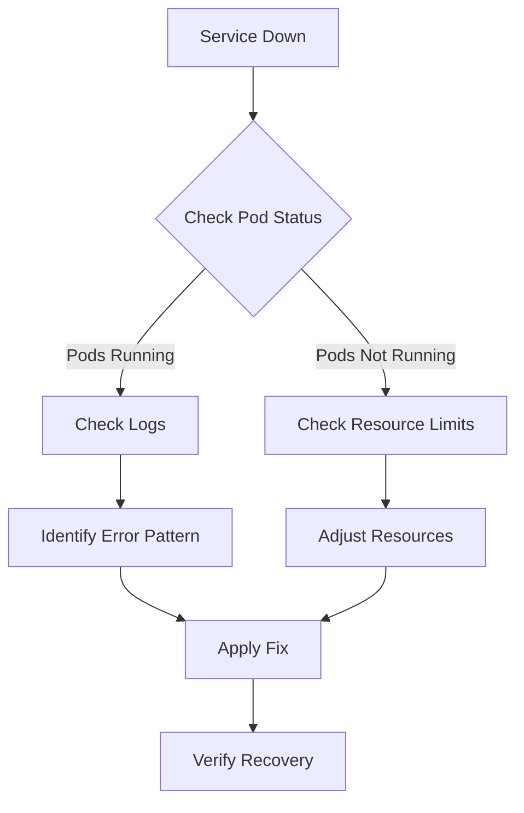
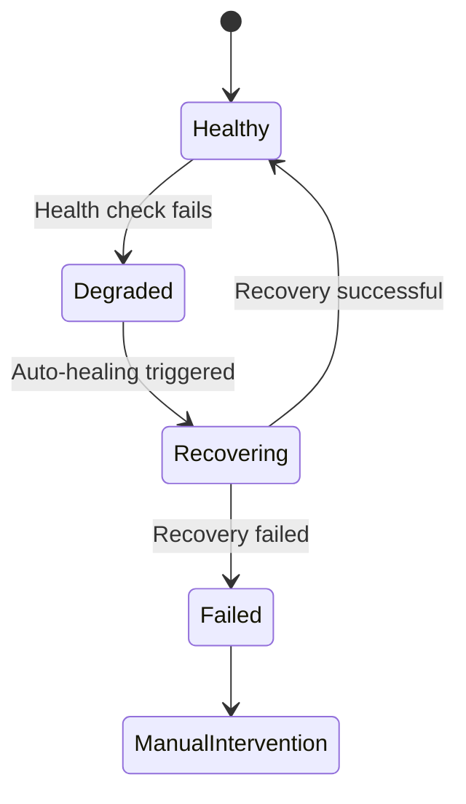
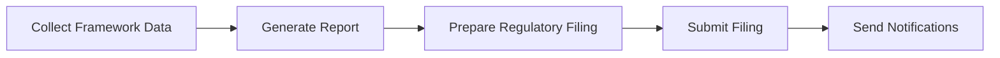

# Troubleshooting Guide

<cite>
**Referenced Files in This Document**   
- [MONITORING.md](file://codex/MONITORING.md)
- [prometheus.yml](file://infrastructure/monitoring/prometheus.yml)
- [alertmanager.yml](file://infrastructure/monitoring/alertmanager.yml)
- [grafana/provisioning/datasources/prometheus.yml](file://infrastructure/monitoring/grafana/provisioning/datasources/prometheus.yml)
- [k8s/api-gateway.yaml](file://infrastructure/k8s/api-gateway.yaml)
- [kubernetes/compliance/deployments.yaml](file://infrastructure/kubernetes/compliance/deployments.yaml)
- [azora-aegis/index.js](file://services/azora-aegis/index.js)
- [azora-mint/server.js](file://services/azora-mint/server.js)
- [azora-nexus/index.js](file://services/azora-nexus/index.js)
- [auto-healing/index.js](file://organs/auto-healing/index.js)
- [automated-compliance-reporting/index.js](file://organs/automated-compliance-reporting/index.js)
</cite>

## Table of Contents
1. [Introduction](#introduction)
2. [Monitoring and Observability](#monitoring-and-observability)
3. [Common Issues and Diagnostic Procedures](#common-issues-and-diagnostic-procedures)
4. [Frontend Troubleshooting](#frontend-troubleshooting)
5. [Backend Troubleshooting](#backend-troubleshooting)
6. [Infrastructure and Deployment Issues](#infrastructure-and-deployment-issues)
7. [Performance Optimization](#performance-optimization)
8. [Recovery Procedures](#recovery-procedures)
9. [Conclusion](#conclusion)

## Introduction
This troubleshooting guide provides comprehensive diagnostic procedures for identifying and resolving common issues in Azora OS. The guide covers frontend, backend, and infrastructure components, with practical examples of debugging techniques. It also explains the relationships between monitoring data and problem resolution, addressing deployment and runtime issues across the system.

**Section sources**
- [README.md](file://README.md#L0-L555)

## Monitoring and Observability
Azora OS implements a robust monitoring and observability framework using Prometheus, Grafana, and AlertManager to ensure high availability and performance of all services.

**Diagram sources**
- [MONITORING.md](file://codex/MONITORING.md#L4-L10)

### Monitoring Architecture
The monitoring stack collects metrics from various services and provides visualization and alerting capabilities. Key components include:

- **Prometheus**: Metrics collection and storage
- **Grafana**: Visualization and dashboarding
- **AlertManager**: Alert routing and notification

### Configuration Files
The monitoring system is configured through several key files:

- `infrastructure/monitoring/prometheus.yml`: Defines scrape configurations for all monitored services
- `infrastructure/monitoring/alertmanager.yml`: Configures alert notification channels
- `infrastructure/monitoring/grafana/provisioning/datasources/prometheus.yml`: Sets up Grafana to use Prometheus as a data source

**Section sources**
- [MONITORING.md](file://codex/MONITORING.md#L4-L242)
- [prometheus.yml](file://infrastructure/monitoring/prometheus.yml#L0-L90)
- [alertmanager.yml](file://infrastructure/monitoring/alertmanager.yml#L0-L36)
- [grafana/provisioning/datasources/prometheus.yml](file://infrastructure/monitoring/grafana/provisioning/datasources/prometheus.yml#L0-L9)

## Common Issues and Diagnostic Procedures
This section outlines common issues encountered in Azora OS and provides step-by-step diagnostic procedures for resolution.

### Services Not Appearing in Prometheus
When services fail to appear in Prometheus, follow this diagnostic procedure:

1. Verify service availability using `docker-compose ps`
2. Check the metrics endpoint directly with `curl http://localhost:3000/metrics`
3. Examine Prometheus targets at http://localhost:9090/targets/
4. Validate the service configuration in `prometheus.yml`

### Grafana Dashboard Not Loading
For Grafana dashboard loading issues:

1. Check Grafana container status with `docker-compose logs grafana`
2. Verify datasource configuration in Grafana settings
3. Ensure dashboard JSON files are valid and properly formatted
4. Confirm network connectivity between Grafana and Prometheus

### Alerts Not Firing
When expected alerts are not triggering:

1. Validate alert rules syntax using `promtool check rules infra/monitoring/prometheus/alert_rules.yml`
2. Verify AlertManager configuration and routing rules
3. Check notification channel settings and credentials
4. Confirm that the alert conditions are being met by examining metrics

**Section sources**
- [MONITORING.md](file://codex/MONITORING.md#L214-L242)

## Frontend Troubleshooting
Frontend issues in Azora OS typically relate to component rendering, state management, and API connectivity.

### Component Rendering Issues
When UI components fail to render correctly:

1. Check browser console for JavaScript errors
2. Verify component props and state using React DevTools
3. Ensure all required dependencies are loaded
4. Validate CSS class names and styling

### API Connectivity Problems
For frontend applications experiencing API connectivity issues:

1. Verify the API endpoint URL and CORS configuration
2. Check network tab in browser developer tools for request/response details
3. Validate authentication tokens and headers
4. Test the API endpoint independently using curl or Postman

**Section sources**
- [ui](file://ui#L0-L1000)
- [app](file://app#L0-L100)

## Backend Troubleshooting
Backend issues often involve service communication, data processing, and business logic errors.

### Service Communication Failures
When services fail to communicate:

1. Verify service availability and health endpoints
2. Check network connectivity between services
3. Validate API contracts and data formats
4. Examine logs for error messages and stack traces

### Data Processing Errors
For issues with data processing pipelines:

1. Validate input data format and structure
2. Check database connectivity and query performance
3. Verify data transformation logic
4. Monitor memory usage and potential leaks

**Diagram sources**
- [k8s/api-gateway.yaml](file://infrastructure/k8s/api-gateway.yaml#L0-L71)
- [azora-mint/server.js](file://services/azora-mint/server.js#L0-L56)

**Section sources**
- [azora-mint/server.js](file://services/azora-mint/server.js#L0-L56)
- [azora-nexus/index.js](file://services/azora-nexus/index.js#L0-L62)

## Infrastructure and Deployment Issues
Infrastructure problems typically involve container orchestration, network configuration, and resource allocation.

### Kubernetes Deployment Failures
When Kubernetes deployments fail:

1. Check pod status with `kubectl get pods -n azora-system`
2. Examine deployment logs using `kubectl logs <pod-name>`
3. Verify resource requests and limits in deployment manifests
4. Check network policies and service configurations

### Resource Exhaustion
For systems experiencing resource exhaustion:

1. Monitor CPU, memory, and disk usage through Grafana dashboards
2. Adjust resource requests and limits in Kubernetes manifests
3. Implement horizontal pod autoscaling
4. Optimize application code for resource efficiency

**Diagram sources**
- [kubernetes/compliance/deployments.yaml](file://infrastructure/kubernetes/compliance/deployments.yaml#L0-L170)

**Section sources**
- [kubernetes/compliance/deployments.yaml](file://infrastructure/kubernetes/compliance/deployments.yaml#L0-L170)
- [vessels](file://vessels#L0-L100)

## Performance Optimization
Performance issues in Azora OS can be addressed through various optimization techniques.

### Query Optimization
For database performance issues:

1. Add appropriate indexes to frequently queried columns
2. Optimize query structure and avoid N+1 queries
3. Implement caching for frequently accessed data
4. Use connection pooling to reduce database connection overhead

### Caching Strategies
Implement caching at multiple levels:

- **Application-level caching**: Store frequently accessed data in memory
- **Database query caching**: Cache query results
- **HTTP response caching**: Cache API responses with appropriate headers
- **CDN caching**: Cache static assets at the edge

### Load Balancing
Configure load balancing to distribute traffic evenly:

1. Use Kubernetes Services with LoadBalancer type
2. Implement health checks to route traffic only to healthy instances
3. Configure session affinity when needed
4. Monitor load distribution and adjust as needed

**Section sources**
- [database-schema.sql](file://infrastructure/database-schema.sql#L0-L100)
- [scaling-config.yaml](file://infrastructure/scaling-config.yaml#L0-L50)

## Recovery Procedures
Azora OS includes several automated recovery mechanisms to ensure system resilience.

### Auto-Healing System
The auto-healing system monitors service health and initiates recovery when issues are detected:

**Diagram sources**
- [auto-healing/index.js](file://organs/auto-healing/index.js#L0-L13)

The auto-healing service exposes a health endpoint at `/health` and runs on port 6000. When a service becomes degraded, the auto-healing system attempts to restart the service or redeploy it in a healthy state.

### Automated Compliance Reporting
The automated compliance reporting system ensures regulatory compliance through periodic reporting:

**Diagram sources**
- [automated-compliance-reporting/index.js](file://organs/automated-compliance-reporting/index.js#L0-L800)

The system generates reports on various schedules (daily, weekly, monthly) and automatically prepares regulatory filings based on the generated reports.

**Section sources**
- [auto-healing/index.js](file://organs/auto-healing/index.js#L0-L13)
- [automated-compliance-reporting/index.js](file://organs/automated-compliance-reporting/index.js#L0-L800)

## Conclusion
This troubleshooting guide provides comprehensive coverage of common issues in Azora OS, from monitoring and diagnostics to recovery procedures. By following the procedures outlined in this guide, system administrators and developers can effectively identify and resolve problems across the frontend, backend, and infrastructure components of the system.

The integration of monitoring data with problem resolution enables proactive issue detection and faster resolution times. The automated recovery procedures ensure system resilience and minimize downtime. For ongoing system health, regular monitoring and performance optimization should be conducted using the tools and techniques described in this guide.