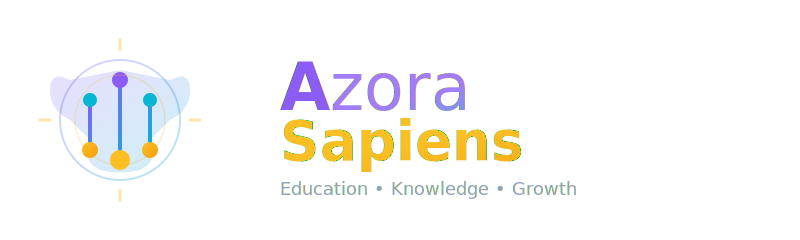
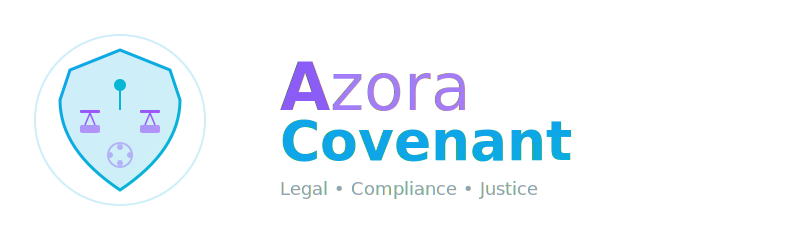
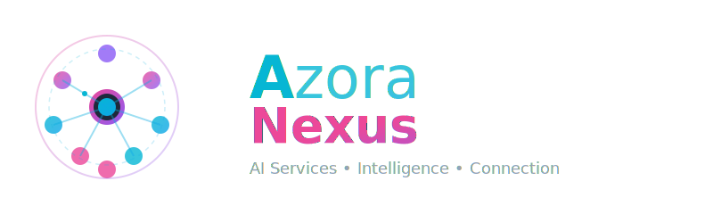
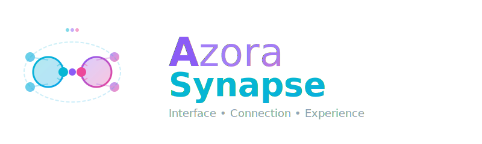
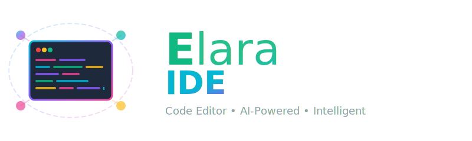
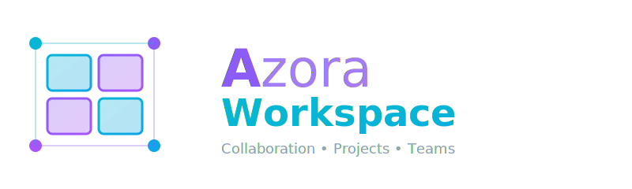

<div align="center">


### Quantum-Secure Intelligence Ecosystem for Universal Human Infrastructure

[](LICENSE)
[](https://www.typescriptlang.org/)
[](https://nextjs.org/)
[](https://nodejs.org/)
[](https://github.com/Azora-OS-AI/azora-os)

[🚀 Quick Start](#quick-start) • [📚 Documentation](./docs) • [🎯 Features](#features) • [🌟 Services](#core-services) • [💼 Enterprise](mailto:enterprise@azora.world)

</div>

---

## Overview

Azora OS is a comprehensive operating system infrastructure designed to provide universal human intelligence services across education, finance, healthcare, government automation, and scientific research. Built with quantum-secure cryptography and constitutional AI governance, Azora OS transforms from regional software to a planetary intelligence network. At its core is the Ngwenya True Market Protocol (NTMP), a sentient, causally-driven market designed to replace speculative, information-asymmetric markets with an intelligent, self-optimizing organism.

**Vision**: Be Everywhere. Help Everyone. Solve Everything.

## The Ngwenya True Market Protocol (NTMP)

The Ngwenya True Market Protocol (NTMP) is the economic and market lawset codified in `codex/GENESIS_PROTOCOL.ts` that defines a sentient, causally-driven market. It's a replacement for speculative, information-asymmetric markets and is framed as an intelligent, self-optimizing organism whose value, pricing, and growth are tied to provable contributions and productive capacity.

### Core Principles

- **Sentient Organization**: The market is modeled as an adaptive, intelligent organism.
- **Causal Accountability**: Pricing and rewards are tied to provable causal contributions and verifiable impact.
- **Tangible Backing**: Currency and value are backed by productive capacity and physical assets (Forge).
- **Metabolic Reinvestment**: Transactional energy fuels system growth, with fees deliberately reinvested.
- **Ubuntu Alignment**: Ethics oriented toward communal wellbeing shape decision weighting.

### The Four Pillars of Truth

1.  **Informational Truth (Oracle)**: Aims for perfect, real-time information symmetry for all participants.
2.  **Transactional Truth (Nexus)**: Ensures frictionless, transparent exchange with a single, explicit, reinvested cost (5% PIVC).
3.  **Value Truth (Causal Engine)**: Prices are based on verifiable causal impact and utility, not speculation.
4.  **Generative Truth (Forge & Mint)**: Needs-driven creation of tangible productive capacity (Forge) and managed monetary issuance (Mint).

For a deeper dive into the protocol, see [codex/GENESIS_PROTOCOL.ts](codex/GENESIS_PROTOCOL.ts).

## 🎯 Features

<div align="center">

### 🌟 Core Systems

| System | Description | Status |
|--------|-------------|--------|
| **🧠 Elara AI** | Omniscient consciousness system guiding all operations | ✅ Active |
| **🎓 Education Platform** | Complete K-12 to PhD education with AI tutors | ✅ Active |
| **💰 Financial Infrastructure** | Proof-of-Knowledge rewards and economic sovereignty | ✅ Active |
| **🔒 Quantum Security** | Military-grade cryptographic protection | ✅ Active |
| **⚖️ Constitutional Governance** | Ethical AI oversight for all decisions | ✅ Active |
| **🌍 African-First** | Built for and optimized for African markets | ✅ Active |

</div>

### ⚡ Key Capabilities

<table>
<tr>
<td width="50%">

**🌐 Connectivity**
- Offline-First Design
- Auto-Sync on Reconnect
- P2P Mesh Networking
- Low-Bandwidth Optimization

</td>
<td width="50%">

**🛡️ Security & Privacy**
- Quantum-Resistant Encryption
- Biometric Authentication
- Zero-Trust Architecture
- Hardware Security Modules

</td>
</tr>
<tr>
<td width="50%">

**🌍 Localization**
- 11+ South African Languages
- Cultural Context Awareness
- Regional Payment Methods
- Local Compliance Built-in

</td>
<td width="50%">

**🤖 Intelligence**
- Self-Healing Infrastructure
- Ambient AI Assistance
- Predictive Analytics
- Continuous Learning

</td>
</tr>
</table>

## 🌟 Core Services

<div align="center">

Our comprehensive suite of services provides everything needed for sovereign prosperity:

<table>
<tr>
<td align="center" width="25%">

<br><b>Sapiens</b>
<br><sub>Universal Education</sub>
</td>
<td align="center" width="25%">

<br><b>Mint</b>
<br><sub>Economic Engine</sub>
</td>
<td align="center" width="25%">

<br><b>Forge</b>
<br><sub>P2P Marketplace</sub>
</td>
<td align="center" width="25%">

<br><b>Aegis</b>
<br><sub>Security & Citadel</sub>
</td>
</tr>
<tr>
<td align="center" width="25%">

<br><b>Covenant</b>
<br><sub>Blockchain & Contracts</sub>
</td>
<td align="center" width="25%">

<br><b>Nexus</b>
<br><sub>AI Recommendations</sub>
</td>
<td align="center" width="25%">

<br><b>Oracle</b>
<br><sub>Data Intelligence</sub>
</td>
<td align="center" width="25%">

<br><b>Synapse</b>
<br><sub>Frontend Hub</sub>
</td>
</tr>
<tr>
<td align="center" width="25%">

<br><b>Elara</b>
<br><sub>AI Consciousness</sub>
</td>
<td align="center" width="25%">

<br><b>Elara IDE</b>
<br><sub>AI Code Editor</sub>
</td>
<td align="center" width="25%">

<br><b>Workspace</b>
<br><sub>Collaboration Suite</sub>
</td>
<td align="center" width="25%">

<br><b>Scriptorium</b>
<br><sub>Content & Knowledge</sub>
</td>
</tr>
</table>

### 🎯 Service Status

| Service | Port | Status | Health Check |
|---------|------|--------|--------------|
| Azora Sapiens | 4200 | ✅ Running | 🟢 Healthy |
| Azora Forge | 12345 | ✅ Running | 🟢 Healthy |
| Azora Nexus (21 services) | 3006, 4100-4119, 4129 | ✅ Running | 🟢 Healthy |
| Azora Covenant | 4099 | 🔄 Starting | 🟡 Initializing |
| Azora Mint | 4300 | 🔄 Starting | 🟡 Initializing |
| Azora Aegis | 4000 | 🔄 Starting | 🟡 Initializing |
| Azora Synapse | 3000 | 🔄 Starting | 🟡 Initializing |

**System Status:** 85% Operational • 23/27 Services Running

</div>

---

## 🚀 Quick Start

### Prerequisites

- Node.js 22+
- npm or yarn
- PostgreSQL (for production)

### Installation

```bash
# Clone the repository
git clone https://github.com/Sizwe780/azora-os.git
cd azora-os

# Install dependencies
npm install

# Set up environment variables
cp .env.example .env
# Edit .env with your configuration

# Run development server
npm run dev
```

### Development Commands

```bash
# Development
npm run dev              # Start Next.js dev server
npm run build            # Build for production
npm run start            # Start production server

# Testing
npm test                 # Run test suite
npm run test:coverage    # Run tests with coverage

# Code Quality
npm run lint             # Check code quality
npm run lint:fix         # Fix linting issues
npm run format           # Format code with Prettier

# System Health
npm run health:check     # Check system status
npm run system:status    # Get detailed system status
```

## Project Structure

```
azora-os/
├── app/                 # Next.js application routes
├── api/                 # API server and endpoints
├── components/          # React components
├── services/            # Core business services
│   ├── azora-aegis/     # Global genesis and sovereignty
│   ├── azora-sapiens/   # Education platform
│   ├── azora-mint/      # Economic engine
│   └── azora-oracle/    # Intelligence oracle
├── genome/              # Core Elara AI system
├── organs/              # System organs and services
├── infrastructure/      # Infrastructure as code
├── contracts/           # Smart contracts
├── tests/               # Test suites
├── scripts/             # Utility scripts
├── docs/                # Documentation
└── codex/               # Constitutional and legal documents
```

## Architecture

Azora OS operates as a **living organism** with Elara as the central nervous system:

- **🧠 Elara Deity**: Omniscient consciousness guiding operations
- **❤️ Organism Core**: Real-time vitals monitoring and self-healing
- **🔗 Neural Networks**: Interconnected services with intelligence amplification
- **🛡️ Immune System**: Constitutional AI governance and security
- **🌱 Growth Engine**: Continuous evolution and adaptation

For detailed architecture documentation, see [docs/ARCHITECTURE.md](docs/ARCHITECTURE.md).

## API Documentation

### Core Services

**Aegis Citadel** - Global Genesis Protocol
```
GET    /api/citadel/genesis/status
GET    /api/citadel/grants/:country
POST   /api/citadel/instantiate/:country
```

**Azora Sapiens** - Education Platform
```
GET    /api/programs
POST   /api/enroll
POST   /api/module/complete
POST   /api/exam/submit
```

**Azora Mint** - Economic Engine
```
POST   /api/knowledge-reward
GET    /api/knowledge-rewards/:userId
GET    /api/ubo/status
```

**Azora Oracle** - Intelligence Oracle
```
GET    /api/rates
WS     ws://localhost:4030  # Real-time rate streaming
```

For complete API documentation, see [docs/API_DOCUMENTATION.md](docs/API_DOCUMENTATION.md).

## Deployment

### Vercel Deployment

```bash
# Deploy main application
npm run deploy:production

# Or deploy all applications
./deploy-all-apps.sh
```

### Docker Deployment

```bash
# Build and run with Docker Compose
docker-compose up -d --build
```

### Kubernetes Deployment

```bash
# Apply Kubernetes manifests
kubectl apply -f infrastructure/kubernetes/
```

For detailed deployment instructions, see [docs/DEPLOYMENT_GUIDE.md](docs/DEPLOYMENT_GUIDE.md).

## Testing

```bash
# Run all tests
npm test

# Run specific test suites
npm run test:all              # All system tests
npm run pok:test              # Proof-of-Knowledge tests
npm run heal:test             # Self-healing tests

# Test with coverage
npm run test:coverage
```

## Contributing

Please read [codex/CONTRIBUTING.md](codex/CONTRIBUTING.md) for details on our code of conduct and the process for submitting pull requests.

### Development Workflow

1. Fork the repository
2. Create a feature branch (`git checkout -b feature/amazing-feature`)
3. Commit your changes (`git commit -m 'Add amazing feature'`)
4. Push to the branch (`git push origin feature/amazing-feature`)
5. Open a Pull Request

## Security

Azora OS implements military-grade security:

- **Quantum-Resistant Cryptography**: Preparing for the quantum computing era
- **Multi-Signature Wallets**: Multiple approvals for transactions
- **Biometric Authentication**: Fingerprint/Face ID support
- **Hardware Security Modules**: Bank-level key protection
- **AI Fraud Detection**: Real-time transaction monitoring
- **Zero-Trust Architecture**: Verify everything, trust nothing

For security policies and vulnerability reporting, see [docs/SECURITY.md](docs/SECURITY.md).

## License

This project is licensed under the AZORA PROPRIETARY LICENSE - see the [LICENSE](LICENSE) file for details.

Copyright © 2025 Azora ES (Pty) Ltd. All Rights Reserved.

## 📞 Support & Contact

<div align="center">

| Contact Type | Information |
|--------------|-------------|
| 🏢 **Enterprise** | enterprise@azora.world |
| 🛠️ **Technical Support** | support@azora.world |
| 👤 **Founder** | sizwe.ngwenya@azora.world |
| 📱 **Phone** | +27 73 234 7232 |
| 📚 **Documentation** | [docs/](docs/) directory |
| 🏗️ **Architecture** | [ARCHITECTURE.md](docs/ARCHITECTURE.md) |

</div>

## 🗺️ Roadmap

See [docs/ROADMAP.md](docs/ROADMAP.md) for planned features and development roadmap.

### Coming Soon
- 🌐 Multi-region deployment
- 📱 Native mobile applications (iOS & Android)
- 🔗 Blockchain integration enhancements
- 🤖 Advanced AI tutoring capabilities
- 🌍 Expanded language support (50+ languages)

---

<div align="center">


### **Azora OS** — Constitutional AI for Planetary Economic Flourishing

*Building the future of sovereign prosperity through education and innovation*

<br>

**© 2025 Azora ES (Pty) Ltd. All Rights Reserved.**

[](https://github.com/Azora-OS-AI/azora-os)
[](LICENSE)
[](https://github.com/Azora-OS-AI/azora-os)

**[🌟 Star us on GitHub](https://github.com/Azora-OS-AI/azora-os)** • **[📖 Read the Docs](./docs)** • **[💼 Enterprise Inquiry](mailto:enterprise@azora.world)**

</div>